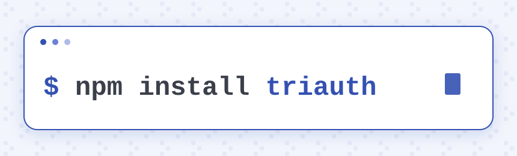

# ⠕ triauth (JS)

**Sign in to websites with just your email address and no passwords.**<br/>
Actually you don't even need an email address, just a domain will do.

**triauth** is a new decentralized protocol for password-less single sign-on where the user's web browser and domain vouches for them.
Public keys are published as DNS TXT records under the user's own domain, and each login is signed by the web browser running on user's device and verified against those records.

Think of it as **DKIM but for web authentication**.

Try it live in the **[playground](https://play.triauth.org)**, or read more on **[triauth.org](https://www.triauth.org/)**.

<hr/>

* This is the home of **official triauth javascript client library**.
* Complete authentication flow is [about 30 lines of code](#synopsis).
* Add **decentralized, password-less single sign-on** to your website in an afternoon.

**Get started:**

<a href="https://www.npmjs.com/package/triauth">
  <picture>
    <source media="(prefers-color-scheme: dark)" srcset="assets/npm-install-triauth-dark.svg">
    
  </picture>
</a>

> 📦 Ships as a dual **ES module / CommonJS** package, with TypeScript type definitions, runs in **Node.js 18+** and modern **browsers**, and has **zero runtime dependencies**.

See **[what you can do with it](#what-you-can-do-with-it)** and the **[public API reference](#public-api-reference)**.

## Table of Contents

* [Status & Version](#status--version)
* [What you can do with it](#what-you-can-do-with-it)
* [Synopsis](#synopsis)
  * [Node.js + Express](#user-content-synopsis-node)
  * [Browser based client-side authentication](#user-content-synopsis-browser)
* [Testing & Conformance](#testing--conformance)
* [Public API Reference](#public-api-reference)
  * [The 3-step challenge-response flow](#user-content-3-step-challenge-response-flow)
  * [Triauth.authenticate](#user-content-triauth-authenticate)
  * [Triauth.check](#user-content-triauth-check)
  * [Triauth.ping](#user-content-triauth-ping)
  * [Triauth.whois](#user-content-triauth-whois)
  * [Triauth.attest](#user-content-triauth-attest)
  * [Triauth.sign](#user-content-triauth-sign)
  * [Triauth.stamp](#user-content-triauth-stamp)
  * [Triauth.verify](#user-content-triauth-verify)
  * [Triauth.validate](#user-content-triauth-validate)
* [Error Codes](#error-codes)
* [Protocol Extensions](#protocol-extensions)
* [Configuration](#configuration)
  * [Default configuration](#default-configuration)
  * [Logging](#logging)
  * [DNS Resolver](#dns-resolver)
  * [Caching DNS responses](#caching-dns-responses)
  * [Randomness](#randomness)
* [Privacy Considerations](#privacy-considerations)
  * [Identifier enumeration and private mode](#identifier-enumeration-and-private-mode)
  * [DNS resolvers](#dns-resolvers)
* [Best Practices and Security Considerations](#best-practices-and-security-considerations)

## Status & Version

Latest release: **triauth-js 1.0.0-beta.1** - [NPM](https://www.npmjs.com/package/triauth/v/1.0.0-beta.1) - [GitHub](https://github.com/triauth/triauth-js/tags) - [jsDelivr](https://cdn.jsdelivr.net/npm/triauth@1.0.0-beta.1/)<br/>

It is suitable for evaluation and early production use - see [Testing & Conformance](#testing--conformance) for how it's validated, and read the [Best Practices and Security Considerations](#best-practices-and-security-considerations) section before you deploy.

We welcome your feedback on how we can make it better: report problems on the [issues tracker](https://github.com/triauth/triauth-js/issues), and security vulnerabilities by following the instructions in [SECURITY.md](https://github.com/triauth/triauth-js/blob/main/SECURITY.md). For the trust model behind the library see [triauth.org/protocol/trust-model](https://www.triauth.org/protocol/trust-model), for release history see [CHANGELOG.md](https://github.com/triauth/triauth-js/blob/main/CHANGELOG.md), and to learn more about the triauth protocol please visit [triauth.org](https://www.triauth.org/).

## What you can do with it

triauth-js is a Swiss Army knife with a dedicated method for each job:

**🔓 Sign in** ([`authenticate`](#user-content-triauth-authenticate))
> Get a cryptographic proof that the user is in control of the `identifier` (e.g., `john@example.com`) and may be signed in with it.

**🔒 Sign out** ([`check`](#user-content-triauth-check), [`ping`](#user-content-triauth-ping)) 
> Confirm that the user may remain signed-in by checking that their keys were not revoked ([`check`](#user-content-triauth-check)), or by obtaining a fresh cryptographic proof of identity and key possession ([`ping`](#user-content-triauth-ping)).

**✍️ Sign** ([`sign`](#user-content-triauth-sign))
> Ask the user to review and sign your ToS or any message, with optional file attachments, and get back a transferable signature you can store, forward to a third party, or check yourself with [`verify`](#user-content-triauth-verify).

**🏅 Attest** ([`attest`](#user-content-triauth-attest))
> Collect third-party attestations about the user, such as "I am not a robot" or "I am over 18", each signed by a verification provider that you trust.

**🔖 Stamp** ([`stamp`](#user-content-triauth-stamp))
> Obtain a silent background signature over a short message, to prove to any third-party that the user is signed in with you.

**🔎 Look up & verify** ([`whois`](#user-content-triauth-whois), [`verify`](#user-content-triauth-verify), [`validate`](#user-content-triauth-validate))
> Read any identifier's public profile, devices, and keys ([`whois`](#user-content-triauth-whois)); verify any triauth signature or stamp on its own ([`verify`](#user-content-triauth-verify)); or pre-check an identifier's format with no DNS lookup ([`validate`](#user-content-triauth-validate)).

## Synopsis

Authentication is two calls to the same method - one to start the login, and one to finish it:

```javascript
import * as Triauth from 'triauth'; // or `require 'triauth';`

// 1. Start: build a challenge and send the user off to approve it.
const { challenge, redirectUrl } = await Triauth.authenticate({
  identifier: 'john@example.com',
  callbackUrl: 'https://yourapp.com/callback'
});
// → store `challenge` in the session, then redirect the browser to `redirectUrl`

// 2. Finish: the user is redirected back with a `response`; verify it.
const result = await Triauth.authenticate({ challenge, response });
if (result.authenticated) {
  // → logged in as result.identifier
}
// delete the stored `challenge` from the session
```

> Easy, right?
> That's the entire authentication flow you need to implement to get started.

Complete runnable examples below:

* [Node.js + Express](#user-content-synopsis-node)
* [Browser based client-side authentication](#user-content-synopsis-browser)

<a name="synopsis-node"></a>

### Node.js

```shell
npm install triauth express express-session
```

<details>

<summary>Notes for Node.js versions prior to 19.x</summary>

> triauth-js uses the global `crypto` object which is available by default starting from Node 19.x.
> For previous Node versions, you may need to use the `--experimental-global-webcrypto` flag, e.g.:
>
> ```shell
> # as a command line argument
> node --experimental-global-webcrypto ...
> # using ENV vars
> export NODE_OPTIONS='--experimental-global-webcrypto' node ...
> # for npx pass it as --node-option
> npx ... --node-option=experimental-global-webcrypto
> ```

</details>

<details>
<summary><b>Complete example</b> - an <a href="https://expressjs.com/">Express.js</a> web application that implements "Sign in with triauth"</summary>

```javascript

const Triauth = require('triauth');

const express = require('express');
const session = require('express-session');
const crypto = require('crypto');
const app = express();

app.use(express.urlencoded({ extended: true }));
app.use(session({secret: crypto.randomBytes(64).toString('hex')})); // replace with your own secret

app.get('/', (req, res) => {
  if (req.session.identifier) {
    return res.send(`Logged in as ${req.session.identifier}`);
  }

  const errorMessage = req.session.error?.message || '';
  req.session.error = null;

  res.send(`
    <form action="/login" method="post">
        <input type="text" name="identifier" placeholder="Enter your identifier">
        <span style="color:red;">${errorMessage}</span>
        <input type="submit" value="Sign in with triauth">
    </form>
  `);  
});

app.post('/login', async (req, res) => {
  const identifier = req.body.identifier;

  // Demo only: in production replace with your own static URL
  // Do not trust req.headers.host unless it is validated by your reverse proxy/framework config.
  const callbackUrl = `${req.protocol}://${req.headers.host}/callback`;
  
  const authResult = await Triauth.authenticate({
    identifier,
    callbackUrl,
    ext: { callbackMethod: 'GET' } // a GET callback brings the session cookie back with it
  });
  
  if (authResult.challenge && authResult.redirectUrl) {
    req.session.challenge = authResult.challenge;
    res.redirect(302, authResult.redirectUrl);
  } else {
    req.session.error = authResult.error;
    res.redirect(302, '/');
  }
});

app.get('/callback', async (req, res) => {
  const challenge = req.session.challenge;
  const response = req.query.response;

  delete req.session.challenge;
 
  const authResult = await Triauth.authenticate({
    challenge,
    response
  });
  
  if (authResult.authenticated) {
    req.session.identifier = authResult.identifier;
  } else {
    req.session.error = authResult.error;
  }

  res.redirect(302, '/'); // always redirect, so that the response does not stay in the address bar
});

app.listen(3000, () => {
  console.log('Server is running on port 3000');
});

```

</details>

<a name="synopsis-browser"></a>

### Web Browser

```html
<script src="https://cdn.jsdelivr.net/npm/triauth@1.0.0-beta.1/dist/triauth.js" crossorigin="anonymous"></script>
<!-- For maximum privacy, self-host the file above instead of loading it from a public CDN. -->
```

<details>
<summary><b>Complete example</b> - a browser-based, client-side web application that implements "Sign in with triauth"</summary>

```html
<script type="module">
  const params = new URLSearchParams(window.location.hash.split('?')[1]);
  window.history.replaceState(null, '', window.location.pathname + window.location.search); // drop the response from the address bar
  
  const challenge = window.sessionStorage.getItem('challenge'); 
  const response = params.get('response');

  const authResult = await window.Triauth.authenticate((challenge && response)
    ? { challenge, response }
    : {
        identifier: window.prompt('Enter your identifier'),
        callbackUrl: window.location.href,
        ext: { callbackMethod: 'HASH', stampToken: true }
      });

  if (challenge && response) {
    window.sessionStorage.removeItem('challenge');
  }
  
  if (authResult.authenticated) {
    alert('Authenticated as ' + authResult.identifier);
  
  } else if (authResult.challenge && authResult.redirectUrl) {
    window.sessionStorage.setItem('challenge', authResult.challenge);
    window.location = authResult.redirectUrl;

  } else if (authResult.error) {
    alert('Error: ' + authResult.error.message);
  
  } 
</script>

```

</details>

> [!WARNING]
> **Authenticate on your server by default.** The client-side example above is for demonstration only.
> It stores the challenge in the user's browser, where the user can tamper with it and sign in as someone else.
> To authenticate the user to a server from the browser, call [`stamp`](#user-content-triauth-stamp) or [`sign`](#user-content-triauth-sign) with a fresh, single-use nonce from that server in the `message`.
> The server then checks the result with [`verify`](#user-content-triauth-verify), pinning `type`, `identifier`, and `via`.

[Back to TOC](#table-of-contents)

<a name="testing--conformance"></a>

## Testing & Conformance

triauth-js currently has over **1,000+ tests for correctness and security**.

It was meticulously hand-crafted over many months, then systematically reviewed and tested to hunt down security issues and footguns. 
No software is free of bugs - if you find one, please report it.

* **Every release is built, tested, and published from CI** - see [`.github/workflows/ci.yml`](https://github.com/triauth/triauth-js/blob/main/.github/workflows/ci.yml). 
* **High test coverage** Enforced minimums of 95% statement, branch, function, and line coverage.
* **Public availability** The code is open, freely available on GitHub, and throughtly documented (JSDoc). Feel free to review it yourself or feed it to your favourite LLM for quick check.
* **AI security reviews.** In addition to human review, we have put the protocol and every public API method through a structured, high-effort security review by AI models. Reviews are committed under [`test/ai-reviews/`](https://github.com/triauth/triauth-js/tree/main/test/ai-reviews).
* **Run the whole suite yourself, in your browser.** Open the [live test runner](https://play.triauth.org/test/) to watch all 1,000+ tests execute in your own browser, or browse the [coverage report](https://play.triauth.org/coverage/).

See the [trust model](https://www.triauth.org/protocol/trust-model) and [Best Practices and Security Considerations](#best-practices-and-security-considerations) for the security reasoning behind these tests, and [`CHANGELOG.md`](https://github.com/triauth/triauth-js/blob/main/CHANGELOG.md) for release history.

[Back to TOC](#table-of-contents)

## Public API Reference

Following methods are available:

* [Triauth.authenticate](#user-content-triauth-authenticate)
* [Triauth.check](#user-content-triauth-check)
* [Triauth.ping](#user-content-triauth-ping)
* [Triauth.whois](#user-content-triauth-whois)
* [Triauth.attest](#user-content-triauth-attest)
* [Triauth.sign](#user-content-triauth-sign)
* [Triauth.stamp](#user-content-triauth-stamp)
* [Triauth.verify](#user-content-triauth-verify)
* [Triauth.validate](#user-content-triauth-validate)

---

<a name="3-step-challenge-response-flow"></a>

> [!TIP]
> Most API methods use the following 3-step challenge-response flow:
>
> 1. **Request:** <br/>
>    Call the method with `identifier` (string), `callbackUrl` (string), and any other required parameters. You'll receive a `challenge` (string) and `redirectUrl` (string).
> 2. **Redirect:** <br/>
>    Securely store the `challenge` and redirect the user's browser to `redirectUrl`.
> 3. **Verify:** <br/>
>    The user's browser brings a `response` back to your `callbackUrl`, by default as a URL query parameter (see [callbackMethod](#protocol-extensions)). Pass both `challenge` and `response` back to the original method to complete the flow. 

<a name="preserve-referrer"></a>

> [!IMPORTANT]
> **Preserve the [referrer](https://developer.mozilla.org/en-US/docs/Web/HTTP/Reference/Headers/Referer) when you redirect to `redirectUrl`.**
> The authenticator **may** reject a redirect that arrives without one, so the navigation to `redirectUrl` must carry a `Referer` http header. 
> The bare origin (e.g. `https://example.com`) is enough.
>
> The browser's default policy (`strict-origin-when-cross-origin`) already sends the origin across a cross-origin redirect, so you usually need to do nothing - just don't suppress it. In particular, do **not** use `rel="noreferrer"` (or `window.open(…, 'noreferrer')`, or a `no-referrer` / `same-origin` `Referrer-Policy`). Watch out for hardening middleware too: [Helmet](https://helmetjs.github.io/), for example, sets `Referrer-Policy: no-referrer` by default.

---

<a name="triauth-authenticate"></a>

### 👉 Triauth.authenticate ({identifier, callbackUrl, challenge, response, ext})

The authenticate method performs a challenge-response authentication based on the triauth protocol.
Successful authentication confirms that the user is in control of the provided identifier, and may be e.g., logged in to your website with it.

The authentication is based on the [3-step challenge-response flow](#user-content-3-step-challenge-response-flow):

**1. Request**

At first, you need to call the `Triauth.authenticate` method with the `identifier` option set to the user provided personal identifier (lowercase string), 
a `callbackUrl` option set to the URL under which your application expects to receive a response (string), 
and an optional `ext` option (object) listing the [protocol extensions](#protocol-extensions) that you wish to use. 

In return, you will receive an object with the `challenge` (string) and `redirectUrl` (string). 
You should temporarily store the `challenge` under the user's session, where the user can't tamper with it, and redirect the user's web browser to the `redirectUrl`.

Synopsis:

```javascript

let result = await Triauth.authenticate({identifier, callbackUrl, ext?});
// @returns {challenge, redirectUrl} the challenge should be remembered, and user redirected to the redirectUrl
// @returns {error:{code, message}} when the input is invalid, DNS resolution fails, or the domain is not configured for triauth

```

<details>
<summary><b>Example</b></summary>

```javascript
await Triauth.authenticate(
  {
    identifier: 'john@triauthdemo.org', 
    callbackUrl: 'https://example.com/triauth-callback'
  }
);
// {
//   challenge: 'eyJjYnVybCI6Imh0dHBzOi8vZXhhbXBsZS5jb20vdHJpYXV0aC1jYWxsYmFjayIsInR5cGUiOiJhdXRoIiwiaWRlbnRpZmllciI6ImpvaG5AdHJpYXV0aGRlbW8ub3JnIiwibm9uY2UiOiJTSWRJaXZRRTVJbkhHQmFUWGhDb0UxMG8iLCJpYXQiOjE3ODcyMjQ3NDg0NDksInZlciI6MX0', 
//   redirectUrl: 'https://auth.triauthdemo.org/auth.html#?challenge=eyJjYnVybCI6Imh0dHBzOi8vZXhhbXBsZS5jb20vdHJpYXV0aC1jYWxsYmFjayIsInR5cGUiOiJhdXRoIiwiaWRlbnRpZmllciI6ImpvaG5AdHJpYXV0aGRlbW8ub3JnIiwibm9uY2UiOiJTSWRJaXZRRTVJbkhHQmFUWGhDb0UxMG8iLCJpYXQiOjE3ODcyMjQ3NDg0NDksInZlciI6MX0'
// }
```

</details>

**2. Redirect**

Once the user's web browser is redirected to the `redirectUrl`, they will be taken to the Triauth Authenticator web application, where they can approve or reject the authentication request. 

If the user approves the authentication request, Triauth Authenticator signs the challenge using one or more private keys that are available to it, and for which matching public keys may be obtained from the identity records stored in the DNS, associated with the user's `identifier`. 
It then redirects the web browser to the `callbackUrl`, by default using a `HTTP GET` method, and passes the signature, together with optional additional data, inside the `response` URL parameter.
The callback method that is used to pass the response to the client application can be configured with the [callbackMethod extension](#protocol-extensions).

If the user declines the authentication request, the Triauth Authenticator sends `false` as the `response`, which `Triauth.authenticate` reports as error 403.

**3. Verify**

Once you receive the callback request under `callbackUrl` and extract the `response` (string), you should pass it to the `Triauth.authenticate` function together with the previously stored `challenge` (string) to obtain authentication result.
If you decide to also pass the `identifier` and/or `callbackUrl` together with `challenge` and `response`, it will be additionally verified that they are the same as embedded in the `challenge`. 

> [!WARNING]
> **Invalidate the challenge after every authentication attempt.**
> Upon authentication attempt, remove, invalidate, or forget the associated `challenge`,
> so that it cannot be re-used in replay attacks.

Synopsis:

```javascript

let authenticationResult = await Triauth.authenticate({challenge, response});
// @returns {authenticated:true, issuedAt, signedAt, verifiedAt, expires, secure, identifier, identityDomain, lookupCode, actor, actorIdentityDomain, actorLookupCode, publicProfile, groups, deviceName, deviceTag, keys, ext} upon successful authentication
// @returns {error:{code, message}} upon failed authentication

```

<details>
<summary><b>Example</b></summary>

```javascript
await Triauth.authenticate(
  {
   challenge:'eyJjYnVybCI6Imh0dHBzOi8vZXhhbXBsZS5jb20vdHJpYXV0aC1jYWxsYmFjayIsInR5cGUiOiJhdXRoIiwiaWRlbnRpZmllciI6ImpvaG5AdHJpYXV0aGRlbW8ub3JnIiwibm9uY2UiOiJTSWRJaXZRRTVJbkhHQmFUWGhDb0UxMG8iLCJpYXQiOjE3ODcyMjQ3NDg0NDksInZlciI6MX0', 
   response:'|auth;john@triauthdemo.org;;https://example.com/;v1;1787224766683;;;S8lEY3KOYs9gsSpCJ8YnbnKHVCJcT0dXRREZCAgfIR_3dqkW3S9eUcfQZc6q2HD2sy56LwndOoSbcGyO2ZbUnw|'
  }
);
//
// {
//   "authenticated": true,
//   "issuedAt": 1787224748449,
//   "signedAt": 1787224766683,
//   "verifiedAt": 1787224766784,
//   "expires": 1787226566784,
//   "secure": true,
//   "identifier": "john@triauthdemo.org",
//   "identityDomain": "john._at.triauthdemo.org",
//   "lookupCode": "",
//   "actor": "",
//   "actorIdentityDomain": "",
//   "actorLookupCode": "",
//   "publicProfile": {
//     "initials": "JD",
//     "name": "John Doe"
//   },
//   "groups": [],
//   "deviceName": "desktop",
//   "deviceTag": "3bi5oE_jXyjGY0WY5n6YqOuzRxfo40fuqDmLGaA5bKQ",
//   "keys": [
//     {
//       "value": "BHAILL142prn8rQsHm5ZlMPUFeMc6niVXXIM8biVY3HPjmaw4tfUD-YZ5unkRve1S9P70Mmgk7IBzgVgQPDRnk8",
//       "options": {
//         "type": "es256",
//         "use": "attest,auth,ping,sign,stamp"
//       },
//       "verified": true,
//       "skipped": false
//     }
//   ],
//   "ext": {}
// }
//
```

</details>

> [!IMPORTANT]  
> Upon successful authentication, the authentication result object will have the `authenticated` property set to `true`, and the authenticated personal identifier available in the `identifier` property.
> 
> Upon failed authentication, the `authenticated` property will be missing or set to a falsy value, and the `error` property will contain [more details about the encountered problem](#error-codes).

When authentication is successful, following properties are included in the authentication result object:

| Property Name         | Type      | Description                                                                                                                                                                                                                                                                                                                                                                                                                                                                                                                                                                                                                                                                                 |
|-----------------------|-----------|---------------------------------------------------------------------------------------------------------------------------------------------------------------------------------------------------------------------------------------------------------------------------------------------------------------------------------------------------------------------------------------------------------------------------------------------------------------------------------------------------------------------------------------------------------------------------------------------------------------------------------------------------------------------------------------------|
| `authenticated`       | `boolean` | Always `true` when authentication is successful.                                                                                                                                                                                                                                                                                                                                                                                                                                                                                                                                                                                                                                            |
| `issuedAt`            | `number`  | Unix timestamp on **your** server's clock at which you issued the challenge in stage 1 - the start of the flow's milestone timeline (`issuedAt` → `signedAt` → `verifiedAt`). Example: `1787224748449`.                                                                                                                                                                                                                                                                                                                                                                                                                                                                                     |
| `signedAt`            | `number`  | Unix timestamp on the **user's device** clock at which the authenticator signed the response. It is verified to fall within the freshness window, but is user-device-asserted. Example: `1787224766683`.                                                                                                                                                                                                                                                                                                                                                                                                                                                                                    |
| `verifiedAt`          | `number`  | Unix timestamp on **your** server's clock at which this library confirmed the signature. Example: `1787224766784`.                                                                                                                                                                                                                                                                                                                                                                                                                                                                                                                                                                          |
| `expires`             | `number`  | If present, the Unix timestamp until which the DNS records backing this authentication are considered fresh. Treat it as a re-verification hint rather than a session or authorization lifetime.  After the expires timestamp has passed, you can use the `Triauth.check` or `Triauth.ping` methods to re-authenticate user.  Please note that the returned `expires` value may be undefined or arbitrarily low. You should implement your own reasonable minimum limits for how quickly or frequently the `Triauth.check` and/or `Triauth.ping` method is called. Example: `1767788894690`.                                                                                                |
| `secure`              | `boolean` | Indicates whether DNSSEC protocol was used and the received DNS responses were properly signed. Many domains do not support DNSSEC yet, and will report `{secure:false}`. For more details, please see the [Best Practices and Security Considerations](#best-practices-and-security-considerations) section. Example: `true`.                                                                                                                                                                                                                                                                                                                                                              |
| `identifier`          | `string`  | Contains the user identifier that has been authenticated. Example: `'john@example.com'`.                                                                                                                                                                                                                                                                                                                                                                                                                                                                                                                                                                                                    |
| `identityDomain`      | `string`  | Contains the domain name under which identity records for the given identifier are stored. Examples: `'john._at.example.com'`, `'_7CXNKJIB._at.example.com'`.                                                                                                                                                                                                                                                                                                                                                                                                                                                                                                                               |
| `lookupCode`          | `string`  | For `mode=private` domains the identity lookup code that you can use e.g., with `Triauth.whois({identifier, lookupCode})`. Empty string if lookup code is not needed.                                                                                                                                                                                                                                                                                                                                                                                                                                                                                                                       |
| `actor`               | `string`  | For delegated authentication (i.e., when the owner of identifier has published an `include` identity record in DNS granting a delegate the right to act on their behalf) contains the identifier of the delegate that actually performed the authentication; for direct authentication (the user's own keys) it is `''`. Example: `assistant@corp.example`.                                                                                                                                                                                                                                                                                                                                 |
| `actorIdentityDomain` | `string`  | For delegated authentication, contains the domain name under which the delegate's identity records are stored; for direct authentication (the user's own keys) it is `''`. Example: `'assistant._at.corp.example'`.                                                                                                                                                                                                                                                                                                                                                                                                                                                                         |
| `actorLookupCode`     | `string`  | For delegated authentication, and `mode=private` actor domains the identity lookup code that you can use e.g., with `Triauth.whois({identifier: actorIdentifier, lookupCode: actorLookupCode})`. Empty string if actor is not set or lookup code is not needed to resolve actor's identity domain.                                                                                                                                                                                                                                                                                                                                                                                          |
| `publicProfile`       | `object`  | Contains an object with additional, publicly available information associated with the identifier, as read from the DNS. Example: `{initials:'JD'}`.                                                                                                                                                                                                                                                                                                                                                                                                                                                                                                                                        |
| `groups`              | `array`   | Fully-qualified group names the identity's DNS records claim membership in, sorted and deduplicated; `[]` when none are published. Group membership changes surface through `Triauth.check`, which returns the current list. Example: `['admins@example.com']`.                                                                                                                                                                                                                                                                                                                                                                                                                             |
| `deviceName`          | `string`  | Contains a user-given, public name of the device that was used for authentication, as read from the DNS key records. Its value is informational only, and `deviceTag` should be used to uniquely identify devices. Example: `'mylaptop'`.                                                                                                                                                                                                                                                                                                                                                                                                                                                   |
| `deviceTag`           | `string`  | Contains a string (up to 255 ASCII characters) that uniquely identifies a device, lookup code (if used), and delegation (when `actor` is present), that was used for authentication. A change in the `deviceTag` may be used to identify a situation when user is logging in from a different or new device. You can use the value of `deviceTag` with the `Triauth.check` function to determine if keys are still present in the DNS and the device and/or associated session may remain authenticated. Examples: `'VpGPcGr5psnmgaq4mPxY5tZ4Adxa5V2Vh1GFVRfQFmk'` (direct authentication), `'VpGPcGr5psnmgaq4mPxY5tZ4Adxa5V2Vh1GFVRfQFmk~K7QJ3FB9M2WZX0C4'` (private-mode authentication). |
| `keys`                | `array`   | Contains an array of objects, each representing a public key as read from identity records in the DNS, that was taken into account during authentication. Example: `[{value: '…', options: {…}, verified: true}]`.                                                                                                                                                                                                                                                                                                                                                                                                                                                                          |
| `ext`                 | `object`  | Contains additional data related to the requested [triauth protocol extensions](#protocol-extensions), or `{}` when none was returned. Example: `{signToken:'triauthdemo.org:ace21…'}`.                                                                                                                                                                                                                                                                                                                                                                                                                                                                                                     |

[Back to TOC](#table-of-contents)

---

<a name="triauth-check"></a>

### Triauth.check ({identifier, deviceTag})

The check method verifies that the user's public keys and delegation associated with the given `deviceTag` are still present and unchanged in the Domain Name System (DNS), and that the user may remain authenticated.
It also returns the user's current group memberships, allowing the application to detect membership changes. 

A key may be removed from the DNS by the user or their organization when, for example, an associated device is stolen, decommissioned, or the user leaves the organization.
Similarly, a delegation may be revoked when the user no longer allows a particular actor to act on their behalf.
Group membership changes may affect the user's access to your application features or resources.

This method may be periodically called with the `identifier` and `deviceTag` as returned by the `Triauth.authenticate` method.

Synopsis:

```javascript

let checkResult = await Triauth.check({identifier, deviceTag});
// @returns {valid:true, secure, expires, groups} keys are still present in the DNS; `expires` (when a number) is the unix timestamp until which the check method need not be called again; `expires` may be undefined when DNS records carry no TTL (e.g., under the NodeDns resolver) - in that case apply your own minimum re-check interval; secure is true only when the domain's `triauth` configuration record and every well-formed record of the identity answer were DNSSEC-validated; `groups` is the identity's current membership list - replace any session-cached groups with it on every check
// @returns {valid:false, reason} when the device should be logged out; reason is 'revoked' (the device's keys are no longer published) or 'unresolved' (the identity itself no longer resolves)
// @returns {error:{code, message}} when status cannot be determined at the moment due to some error

```

<details>
<summary><b>Example</b></summary>

```javascript
await Triauth.check(
  {
    identifier: "john@triauthdemo.org",
    deviceTag: "3bi5oE_jXyjGY0WY5n6YqOuzRxfo40fuqDmLGaA5bKQ"
  }
);
//
// {
//   "valid": true,
//   "secure": true,
//   "expires": 1737547197157,
//   "groups": []
// }
//
```

</details>

<details>
<summary><b>Result properties</b></summary>

The result object has the following properties:

| Property Name | Type      | Description |
|---------------|-----------|-------------|
| `valid`       | `boolean` | `true` when the keys and the delegation behind `deviceTag` are still published and the device may remain authenticated. `false` when the device must be signed out. |
| `reason`      | `string`  | Only when `valid` is `false`. `'revoked'` means that the keys of the device, or its delegation, are no longer published. `'unresolved'` means that the identifier itself no longer resolves. |
| `secure`      | `boolean` | Only when `valid` is `true`. `true` only when DNSSEC protected every DNS record that this result depends on. |
| `expires`     | `number`  | Only when `valid` is `true`. Unix timestamp until which the DNS records behind this result are considered fresh, so that you need not call `Triauth.check` again before it. It may be `undefined` when the records have no TTL, or arbitrarily low. Apply your own minimum re-check interval. Example: `1737547197157`. |
| `groups`      | `array`   | Only when `valid` is `true`. The current fully-qualified group names that the identity records of `identifier` claim membership in, sorted and deduplicated. Replace any session-cached groups with this list on every check. Example: `['admins@example.com']`. |

</details>

[Back to TOC](#table-of-contents)

---

<a name="triauth-ping"></a>

### Triauth.ping ({identifier, callbackUrl, token, challenge, response, ext})

The `ping` method may be used to re-authenticate the user in background, by obtaining a fresh proof that the user still has access to cryptographic keys.
While the `Triauth.check` method ensures only that the keys and the optional delegation used for authentication were not changed or removed from DNS,
`Triauth.ping` goes a step further, and requires a fresh, valid signature.

Pings typically do not require any interaction from the user, and may be used as one of the signals in Continuous Authentication schemes.

> [!NOTE]  
> **To use this function you must request and obtain a special `pingToken`**
>
> <details>
> <summary>Details</summary>
>
> To do so, provide the `ext:{pingToken:true}` parameter to the `Triauth.authenticate` function during the initial call (i.e., when building the challenge),
> and in the authentication result you will receive `ext.pingToken` property (string).
> You should keep the `pingToken` value private, and pass it as a `token` parameter in the initial call to the `ping` method.
> The token is issued by the authenticator on the device that signed in, and only that device honors it.
> A user with several devices holds a different token on each.
>
> Also, the `callbackUrl` used in this method must have the **same base URL** (its origin plus the path up to and including the last `/`) as the `callbackUrl` from the initial `Triauth.authenticate` call.
> For example, if `callbackUrl` used for authentication was `https://example.com/dir1/callback`, the `callbackUrl` used in this method
> must sit in that same `https://example.com/dir1/` base directory - only the final path segment may differ, e.g., `https://example.com/dir1/this-callback` (a deeper path such as `https://example.com/dir1/dir2/this-callback` does **not** match the base URL, and the request will be rejected).
>
> </details>

The ping is based on the [3-step challenge-response flow](#user-content-3-step-challenge-response-flow):

**1. Request**

At first, you need to call the `Triauth.ping` method with the `identifier` option set to the user provided personal identifier (lowercase string),
a `callbackUrl` option set to the URL under which your application expects to receive a response (string),
a `token` (string) option set to the `pingToken` previously obtained via `ext.pingToken` from a `Triauth.authenticate` call,
and an optional `ext` option (object) listing the [protocol extensions](#protocol-extensions) that you wish to use.

In return, you will receive an object with the `challenge` (string) and `redirectUrl` (string).
You should temporarily store the `challenge` under the user's session, where the user can't tamper with it, and redirect the user's web browser to the `redirectUrl`.

Synopsis:

```javascript

let result = await Triauth.ping({identifier, callbackUrl, token, ext});
// @returns {challenge, redirectUrl} the challenge should be remembered, and user redirected to the redirectUrl
// @returns {error} on error

```

<details>
<summary><b>Example</b></summary>

```javascript

await Triauth.ping(
  {
    identifier:'john@triauthdemo.org', 
    callbackUrl:'https://example.com/callback',
    token:':SvUj6xL4PhtYnNEboKbJ85WW'
  }
);
//
// {
//   challenge: 'eyJjYnVybCI6Imh0dHBzOi8vZXhhbXBsZS5jb20vY2FsbGJhY2siLCJ0eXBlIjoicGluZyIsImlkZW50aWZpZXIiOiJqb2huQHRyaWF1dGhkZW1vLm9yZyIsIm5vbmNlIjoicWFvU1JnZlVnREpwZG5LX1FnQTd4SG9ZIiwiaWF0IjoxNzg3MjI0NzQ4NDQ5LCJ2ZXIiOjF9', 
//   redirectUrl: 'https://auth.triauthdemo.org/ping.html#?challenge=eyJjYnVybCI6Imh0dHBzOi8vZXhhbXBsZS5jb20vY2FsbGJhY2siLCJ0eXBlIjoicGluZyIsImlkZW50aWZpZXIiOiJqb2huQHRyaWF1dGhkZW1vLm9yZyIsIm5vbmNlIjoicWFvU1JnZlVnREpwZG5LX1FnQTd4SG9ZIiwiaWF0IjoxNzg3MjI0NzQ4NDQ5LCJ2ZXIiOjF9&token=:DFB4aHZqJ6zpbq8QVqQfTM4rsCkuCuyBqokCaImZelE'
// }
//
```

</details>

**2. Redirect**

Once the user's web browser is redirected to the `redirectUrl`, and assuming that the `token` is valid, the Triauth Authenticator web application will immediately respond to the `callbackUrl`.

The Triauth Authenticator application redirects the user's web browser to the previously provided `callbackUrl`, by default through the [HTTP GET method](https://developer.mozilla.org/en-US/docs/Web/HTTP/Reference/Methods/GET), and passes a fresh signature in the `response` URL parameter.
The method that is used to pass the response to your application can be configured with the [callbackMethod extension](#protocol-extensions).

**3. Verify**

Once you extract the `response` (string), you should pass it to the `Triauth.ping` function together with the previously stored `challenge` (string) to obtain ping result.
If you decide to also pass the `identifier` and/or `callbackUrl` together with `challenge` and `response`, it will be additionally verified that they are the same as embedded in the `challenge`.

Synopsis:

```javascript

let pingResult = await Triauth.ping({challenge, response});
// @returns {pinged:true, issuedAt, signedAt, verifiedAt, expires, secure, identifier, identityDomain, lookupCode, actor, actorIdentityDomain, actorLookupCode, groups, deviceName, deviceTag, keys} upon success
// @returns {error:{code, message}} upon error

```

<details>
<summary><b>Example</b></summary>

```javascript
await Triauth.ping(
  {
   challenge:'eyJjYnVybCI6Imh0dHBzOi8vZXhhbXBsZS5jb20vY2FsbGJhY2siLCJ0eXBlIjoicGluZyIsImlkZW50aWZpZXIiOiJqb2huQHRyaWF1dGhkZW1vLm9yZyIsIm5vbmNlIjoicWFvU1JnZlVnREpwZG5LX1FnQTd4SG9ZIiwiaWF0IjoxNzg3MjI0NzQ4NDQ5LCJ2ZXIiOjF9', 
   response:'|ping;john@triauthdemo.org;;https://example.com/;v1;1787224751161;;;KalL2ivLz--0voQXL-jBp58650Hj1PIUpe8W4Nfps0HnRdlXMFu6wDUCssE_dr6_BrKRtT508BRXe3228yiA_A|'
  }
);

//
// {
//   "pinged": true,
//   "issuedAt": 1787224748449,
//   "signedAt": 1787224751161,
//   "verifiedAt": 1787224751262,
//   "expires": 1787226551262,
//   "secure": true,
//   "identifier": "john@triauthdemo.org",
//   "identityDomain": "john._at.triauthdemo.org",
//   "lookupCode": "",
//   "actor": "",
//   "actorIdentityDomain": "",
//   "actorLookupCode": "",
//   "groups": [],
//   "deviceName": "desktop",
//   "deviceTag": "3bi5oE_jXyjGY0WY5n6YqOuzRxfo40fuqDmLGaA5bKQ",
//   "keys": [
//     {
//       "value": "BHAILL142prn8rQsHm5ZlMPUFeMc6niVXXIM8biVY3HPjmaw4tfUD-YZ5unkRve1S9P70Mmgk7IBzgVgQPDRnk8",
//       "options": {
//         "type": "es256",
//         "use": "attest,auth,ping,sign,stamp"
//       },
//       "verified": true,
//       "skipped": false
//     }
//   ]
// }
//
```

</details>

Upon successful pinging, the result object will have the `pinged` property set to `true`.
You can also check that the returned `identifier`, `deviceTag`, and `secure` values match your expectations.
Note that `expires` may be undefined or arbitrarily low - apply your own minimum re-ping interval, as described for `Triauth.authenticate`.

Upon failed pinging, the `pinged` property will be missing or set to a falsy value, and the `error` property will contain [more details about the encountered problem](#error-codes).

> [!NOTE]  
> Users may configure a different set of cryptographic keys (that still belongs to the same device) for the purpose of responding to ping requests.
> You can assume that the `deviceTag` in `ping` result should be the same as in the original `Triauth.authenticate` response, but the combination of verified/skipped keys may differ.

<details>
<summary><b>Result properties</b></summary>

When `pinged` is `true`, the result object has the following properties. They have the same meaning as in the [`Triauth.authenticate` result](#user-content-triauth-authenticate).

| Property Name         | Type      | Description                                                                                                                                                                                                                                                                                                                       |
|-----------------------|-----------|-----------------------------------------------------------------------------------------------------------------------------------------------------------------------------------------------------------------------------------------------------------------------------------------------------------------------------------|
| `pinged`              | `boolean` | Always `true` when the ping is successful.                                                                                                                                                                                                                                                                                        |
| `issuedAt`            | `number`  | Unix timestamp on **your** server's clock at which you issued the challenge in stage 1. Example: `1787224748449`.                                                                                                                                                                                                                 |
| `signedAt`            | `number`  | Unix timestamp on the **user's device** clock at which the authenticator signed the response. Example: `1787224751161`.                                                                                                                                                                                                           |
| `verifiedAt`          | `number`  | Unix timestamp on **your** server's clock at which this library confirmed the signature. Example: `1787224751262`.                                                                                                                                                                                                                |
| `expires`             | `number`  | Unix timestamp until which the DNS records behind this result are considered fresh. It may be `undefined` when the records have no TTL, or arbitrarily low. Apply your own minimum re-ping interval. Example: `1787226551262`.                                                                                                    |
| `secure`              | `boolean` | `true` only when DNSSEC protected every DNS record that this result depends on.                                                                                                                                                                                                                                                   |
| `identifier`          | `string`  | The identifier that responded to the ping. It is the same as in the challenge. Example: `'john@example.com'`.                                                                                                                                                                                                                     |
| `identityDomain`      | `string`  | The domain name under which the identity records of `identifier` are stored. Example: `'john._at.example.com'`.                                                                                                                                                                                                                   |
| `lookupCode`          | `string`  | The lookup code of `identifier` under `mode=private`. `''` when no lookup code is needed.                                                                                                                                                                                                                                         |
| `actor`               | `string`  | For a delegated ping, the identifier of the actor that used their own keys on behalf of `identifier`. `''` when the user's own keys were used. Example: `'assistant@corp.example'`.                                                                                                                                               |
| `actorIdentityDomain` | `string`  | For a delegated ping, the domain name under which the identity records of `actor` are stored. `''` when there is no actor.                                                                                                                                                                                                        |
| `actorLookupCode`     | `string`  | For a delegated ping, the lookup code of `actor` under `mode=private`. `''` when there is no actor or no lookup code is needed.                                                                                                                                                                                                   |
| `groups`              | `array`   | Fully-qualified group names that the identity records of `identifier` claim membership in, sorted and deduplicated. `[]` when none are published. Example: `['admins@example.com']`.                                                                                                                                              |
| `deviceName`          | `string`  | The user-given name of the device that signed, as read from the key records. Informational only. Example: `'desktop'`.                                                                                                                                                                                                            |
| `deviceTag`           | `string`  | The tag that identifies the device that signed, together with its lookup code and its delegation. It must be the same as the `deviceTag` from the `Triauth.authenticate` result.                                                                                                                                                  |
| `keys`                | `array`   | The public keys of the device that signed, as read from the key records. Each key has a `value`, its `options`, a `verified` flag, and a `skipped` flag. `verified` is `true` when the key matched the signature. `skipped` is `true` when the key's `use` option excludes this type of signature. Every key is one or the other. |

</details>

[Back to TOC](#table-of-contents)

---

<a name="triauth-whois"></a>

### Triauth.whois ({identifier, lookupCode?})

The whois method checks whether a given identifier exists and retrieves the public details stored in its identity records.
For domains operating in `mode=private`, the `lookupCode` is required to look up the identity records.

Upon success, it returns an object with a `status` property of: 
`-1` if domain does not exist or is not configured for triauth, 
`0` if domain is configured but identifier does not exist or could not be located (e.g., a missing or wrong `lookupCode` under `mode=private`), 
and `1` if identifier exists.

On error, it returns an `{error: {code, message}}` object instead.

Synopsis:

```javascript

let whoisResult = await Triauth.whois({identifier});
let whoisResult = await Triauth.whois({identifier, lookupCode}); // for an identity under a mode=private domain
// @returns {error: {code: number, message: string}} upon error
// @returns {status:1, identifier, authenticationEndpoint:{…}, identityDomain, secure, publicProfile:{…}, groups:[…], devices:[…], includes:[…]} if identifier exists
// @returns {status:0, identifier, authenticationEndpoint:{…}, identityDomain} if domain is configured for triauth but the identifier does not exist or, for mode=private domains, a missing or wrong lookupCode was supplied
// @returns {status:-1, identifier} if domain is not configured for triauth
```

<details>
<summary><b>Example</b></summary>

```javascript
await Triauth.whois({identifier: 'john@triauthdemo.org'});
// (output for the conformance suite's zone - the public demo zone publishes keys of its own)
// {
//   "status": 1,
//   "identifier": "john@triauthdemo.org",
//   "authenticationEndpoint": {
//     "url": "https://auth.triauthdemo.org/",
//     "options": {
//       "mode": "public",
//       "include": "any"
//     },
//     "secure": true
//   },
//   "identityDomain": "john._at.triauthdemo.org",
//   "secure": true,
//   "publicProfile": {
//     "initials": "JD",
//     "name": "John Doe"
//   },
//   "groups": [],
//   "devices": [
//     {
//       "deviceName": "laptop",
//       "deviceTag": "5I4NnX-4lW3gdTqGW3zKpLsLR9oRiWip8zp6mqQgkL4",
//       "keys": [
//         {
//           "value": "BCkB_Cr-7pvY1Y2buYRksJPb09Tqld7M3SDII36cp_C7k08NPTWvbj0p14oMBGDGbGZ1qLkfnJSARBbAj1sA0fs",
//           "options": {
//             "type": "es256",
//             "use": "attest,auth,ping,sign,stamp"
//           }
//         },
//         {
//           "value": "BLglw14iw47KUztRHdeKNfBBBMf5P4SsZg9O9za44mO2BceHZlcQwFmtO1crjVNnwwZszqtMhErs3divGeQrQI4",
//           "options": {
//             "type": "es256",
//             "use": "attest,auth,ping,sign,stamp"
//           }
//         }
//       ]
//     },
//     {
//       "deviceName": "desktop",
//       "deviceTag": "3bi5oE_jXyjGY0WY5n6YqOuzRxfo40fuqDmLGaA5bKQ",
//       "keys": [
//         {
//           "value": "BHAILL142prn8rQsHm5ZlMPUFeMc6niVXXIM8biVY3HPjmaw4tfUD-YZ5unkRve1S9P70Mmgk7IBzgVgQPDRnk8",
//           "options": {
//             "type": "es256",
//             "use": "attest,auth,ping,sign,stamp"
//           }
//         }
//       ]
//     }
//   ],
//   "includes": []
// }
//
```

</details>

<details>
<summary><b>Result properties</b></summary>

The result object has the following properties:

| Property Name            | Type      | Description                                                                                                                                                                                                                                                                                                                                                                                                            |
|--------------------------|-----------|------------------------------------------------------------------------------------------------------------------------------------------------------------------------------------------------------------------------------------------------------------------------------------------------------------------------------------------------------------------------------------------------------------------------|
| `status`                 | `number`  | `1` when the identifier exists. `0` when the domain is configured for triauth but the identifier does not exist, or when the `lookupCode` is missing or wrong under `mode=private`. `-1` when the domain is not configured for triauth.                                                                                                                                                                                |
| `identifier`             | `string`  | The identifier that was looked up. Example: `'john@example.com'`.                                                                                                                                                                                                                                                                                                                                                      |
| `authenticationEndpoint` | `object`  | Only when `status` is `0` or `1`. The domain's `triauth` record. Its `url` is the address of the authenticator. Its `options` are the options of the record, with `mode` and `include` at their defaults when the record does not spell them. Its `secure` is `true` when DNSSEC protected the record. Example: `{url:'https://auth.example.com/', options:{mode:'public', include:'any'}, secure:true}`.              |
| `identityDomain`         | `string`  | Only when `status` is `0` or `1`. The domain name under which the identity records of `identifier` are stored. `null` when the domain is in `mode=private` and no `lookupCode` was given. Examples: `'john._at.example.com'`, `'_7CXNKJIB._at.example.com'`.                                                                                                                                                           |
| `secure`                 | `boolean` | Only when `status` is `1`. `true` only when DNSSEC protected the domain's `triauth` record and every identity record that was read.                                                                                                                                                                                                                                                                                    |
| `publicProfile`          | `object`  | Only when `status` is `1`. Public profile entries of `identifier`, as read from the identity records. `name` and `initials` are the recognized keys, and keys with the `x-` prefix are extensions. Values are raw text. Escape them before you render them. Example: `{name:'John Doe', initials:'JD'}`.                                                                                                               |
| `groups`                 | `array`   | Only when `status` is `1`. Fully-qualified group names that the identity records of `identifier` claim membership in, sorted and deduplicated. `[]` when none are published. Example: `['admins@example.com']`.                                                                                                                                                                                                        |
| `devices`                | `array`   | Only when `status` is `1`. One entry per device whose key records are complete and well-formed. Each entry has the `deviceName`, the `deviceTag`, and the `keys` of the device. Each key has a `value` and its `options`.                                                                                                                                                                                              |
| `includes`               | `array`   | Only when `status` is `1`. The `include` records that the domain's include policy admits, ordered by `tag`. Each entry has a `ref`, `options`, and a `tag`. The `ref` is the actor, as an identifier or an identity domain. The `options` are `use` and `scope`. The `tag` is the first segment of a delegated `deviceTag`. Example: `[{ref:'jane@example.com', options:{use:'sign', scope:'any'}, tag:'LJwdl7N9…'}]`. |

</details>

[Back to TOC](#table-of-contents)

---

<a name="triauth-attest"></a>

### Triauth.attest ({identifier, callbackUrl, attestations, token, challenge, response, ext})

The `attest` method obtains third-party verified attestations associated with the user's `identifier`.
You can request attestations of almost anything, like the user age, not-a-robot status, location, role, etc., given that there is a verification provider that provides such attestation.

The `attestations` argument is an object whose keys are caller-chosen attestation IDs (e.g., `'not-a-robot'`) and whose values describe each requested attestation.
Each attestation consists of a `label` (string) displayed to the user (e.g., 'I am not a robot') and `providers` (an array of `https://` URL strings) from which the user can select a verification provider.
Give each attestation its own provider URL. One signature satisfies every attestation ID whose `providers` list contains its URL, so two attestations that share a provider are satisfied together.

When the user clicks the 'verify' button for an attestation, they are directed to the selected provider's URL.
The provider verifies that the user meets the specified criteria (e.g., those indicated in the URL) and returns a digital signature.
These signatures are included in the final response you receive and verified when you call `Triauth.attest` in stage '3. Verify'.

> [!IMPORTANT]
> **You choose which providers to trust, and the provider defines what the attestation means.**<br/>
> `Triauth.attest` only verifies that a signature came from an identity at the host of one of the `providers` you listed. It does not interpret what that provider actually checked.

> [!NOTE]
> **Attestations in triauth may be anonymous.**<br/>
> By default, verification providers receive only the user-selected verification provider URL, and the domain name of user's authentication endpoint (e.g., `auth.triauth.org`).
> They can later ask the user for their full identifier if needed and set a constraint that the attestation is valid only for the given identifier.

> [!NOTE]  
> **To use this function you must request and obtain a special `attestToken`**
>
> <details>
> <summary>Details</summary>
>
> To do so, provide the `ext:{attestToken:true}` parameter to the `Triauth.authenticate` function during the initial call (i.e., when building the challenge),
> and, given that the user agrees and/or authenticator supports it, in the authentication result you will receive `ext.attestToken` property (string).
> You should keep the `attestToken` value private, and pass it as a `token` parameter in the initial call to the `attest` method.
> The token is issued by the authenticator on the device that signed in, and only that device honors it.
> A user with several devices holds a different token on each.
>
> Also, the `callbackUrl` used in this method must have the **same base URL** (its origin plus the path up to and including the last `/`) as the `callbackUrl` from the initial `Triauth.authenticate` call.
> For example, if `callbackUrl` used for authentication was `https://example.com/dir1/callback`, the `callbackUrl` used in this method
> must sit in that same `https://example.com/dir1/` base directory — only the final path segment may differ, e.g., `https://example.com/dir1/this-callback` (a deeper path such as `https://example.com/dir1/dir2/this-callback` does **not** match the base URL, and the request will be rejected).
>
> </details>

The attestations are based on the [3-step challenge-response flow](#user-content-3-step-challenge-response-flow):

**1. Request**

At first, you need to call the `Triauth.attest` method with the `identifier` option set to the user provided personal identifier (lowercase string),
a `callbackUrl` option set to the URL under which your application expects to receive a response (string),
an `attestations` option (object) whose keys are caller-chosen attestation IDs and whose values consist of a `label` (string) and `providers` (array of `https://` URL strings),
a `token` (string) option set to the `attestToken` previously obtained via `ext.attestToken` from a `Triauth.authenticate` call,
and an optional `ext` option (object) listing the [protocol extensions](#protocol-extensions) that you wish to use.

In return, you will receive an object with the `challenge` (string) and `redirectUrl` (string).
You should temporarily store the `challenge` under the user's session, where the user can't tamper with it, and redirect the user's web browser to the `redirectUrl`.

> [!TIP]  
> The URLs of verification providers are shown in the UI, so keep them short and human-friendly.

Synopsis:

```javascript

let result = await Triauth.attest({identifier, callbackUrl, attestations, token, ext});
// @returns {challenge, redirectUrl} the challenge should be remembered, and user redirected to the redirectUrl
// @returns {error} on error

```

<details>
<summary><b>Example</b></summary>

```javascript
await Triauth.attest(
  {
    identifier: 'john@triauthdemo.org', 
    callbackUrl: 'https://example.com/triauth-callback', 
    attestations: {
      'not-a-robot': {
        label: 'I am not a robot',
        providers: [
          'https://attest.triauthdemo.org/not-a-robot',
          'https://other-provider.example.com/i-am/not-a-robot'
        ]
      }
    }, 
    token: ':tgX6ZXfNi3xwzSwuennigDoA'
  }
);
// {challenge: 'eyJjYn…JdfX19', redirectUrl: 'https://auth.triauthdemo.org/attest.html#?challenge=eyJjYn…JdfX19&token=:WE4zaN5WA_NuHX1BW4wBidu_Sef2aqkzA-gOxlyLmeE'}
```

</details>

**2. Redirect**

Once the user's web browser is redirected to the `redirectUrl`, the Triauth Authenticator web application displays the requested attestations.
For each attestation, it shows your `label`, a dropdown listing the `providers`, and a 'Verify' button, allowing the user to select a provider and complete the verification.

If the user declines the request, the Triauth Authenticator sends `false` as the `response`, which `Triauth.attest` reports as error 403.

**3. Verify**

The Triauth Authenticator application redirects the user's web browser to the previously provided `callbackUrl`, by default through the [HTTP GET method](https://developer.mozilla.org/en-US/docs/Web/HTTP/Reference/Methods/GET), and passes the attestation in the `response` URL parameter.
The method that is used to pass the response to your application can be configured with the [callbackMethod extension](#protocol-extensions).

Once you extract the `response` (string), you should pass it to the `Triauth.attest` function together with the previously stored `challenge` (string) to obtain attestation result.
If you decide to also pass the `identifier` and/or `callbackUrl` together with `challenge` and `response`, it will be additionally verified that they are the same as embedded in the `challenge`.

Synopsis:

```javascript

let attestResult = await Triauth.attest({challenge, response});
// @returns {attested:true, issuedAt, signedAt, verifiedAt, expires, secure, identifier, identityDomain, lookupCode, actor, actorIdentityDomain, actorLookupCode, groups, attestations, deviceName, deviceTag, keys} upon success
// @returns {error:{code, message}} upon failure

```

<details>
<summary><b>Example</b></summary>

```javascript
await Triauth.attest(
  {
   challenge:'eyJjYn…JdfX19', 
   response:'|attest;john@triauthdemo.org;;https://example.com/;v1;1787224773556;;;MsVdr13VwgivjiTRnp78ncX2skDvZf5MdWLqXTXrMmo0VUtmn6R7gx1qJVhLJGYojMh9C4Lj2b_wxtbFlaZltg|attest;robot-attester@attest.triauthdemo.org;;https://attest.triauthdemo.org/not-a-robot;v1;1787224768930;;;AvbmMJwAcE0B_EaBv0EdMAcBAwJVY0BpN1MOmARhc_LdS6QsQzgwSNUaahjL_UyA8qXoiEqqtDXrlkG_1fWBpg|'
  }
);

//
// {
//   "attested": true,
//   "issuedAt": 1787224748449,
//   "signedAt": 1787224773556,
//   "verifiedAt": 1787224773991,
//   "expires": 1787226573991,
//   "secure": true,
//   "identifier": "john@triauthdemo.org",
//   "identityDomain": "john._at.triauthdemo.org",
//   "lookupCode": "",
//   "actor": "",
//   "actorIdentityDomain": "",
//   "actorLookupCode": "",
//   "groups": [],
//   "attestations": {
//     "not-a-robot": {
//       "valid": true,
//       "type": "attest",
//       "identifier": "robot-attester@attest.triauthdemo.org",
//       "identityDomain": "robot-attester._at.attest.triauthdemo.org",
//       "lookupCode": "",
//       "actor": "",
//       "actorIdentityDomain": "",
//       "actorLookupCode": "",
//       "via": "https://attest.triauthdemo.org/not-a-robot",
//       "ver": 1,
//       "signedAt": 1787224768930,
//       "verifiedAt": 1787224773991,
//       "publicProfile": {
//         "name": "Robot Checker"
//       },
//       "groups": [],
//       "deviceName": "server",
//       "deviceTag": "NOtejuAqKHSdgvKVpw57cU_Qipj6UKcz2nNiugx0l8g",
//       "keys": [
//         {
//           "value": "BMR8Ug7qu9HUc9UgY_ADh8giBNmWBbSmGsR6DD6Hg5rpWeyYvu2WlQ43iR_dj0eKN99esQNMe7Gq2u2LBnRejcU",
//           "options": {
//             "use": "attest",
//             "type": "es256"
//           },
//           "verified": true,
//           "skipped": false
//         }
//       ],
//       "secure": true,
//       "expires": 1787226573991,
//       "signedMetadata": {},
//       "unsignedMetadata": {}
//     }
//   },
//   "deviceName": "desktop",
//   "deviceTag": "3bi5oE_jXyjGY0WY5n6YqOuzRxfo40fuqDmLGaA5bKQ",
//   "keys": [
//     {
//       "value": "BHAILL142prn8rQsHm5ZlMPUFeMc6niVXXIM8biVY3HPjmaw4tfUD-YZ5unkRve1S9P70Mmgk7IBzgVgQPDRnk8",
//       "options": {
//         "type": "es256",
//         "use": "attest,auth,ping,sign,stamp"
//       },
//       "verified": true,
//       "skipped": false
//     }
//   ]
// }
//
```

</details>

Upon successful attestation, the result object will have the `attested` property set to `true`.

Upon failed attestation, the `attested` property will be missing or set to a falsy value, and the `error` property will contain [more details about the encountered problem](#error-codes).

When `attested` is `true`, inspect the result before relying on it:
- Check `secure`. It is `true` only when DNSSEC protected every DNS record of every identity involved in verification (the user's and every attester's, including each domain's `triauth` configuration record). When it is `false`, some of the public keys read from DNS were not cryptographically protected.
- For attestations that must be tied to this specific user, confirm that the per-attestation `attestations.<id>.signedMetadata.bind` carries the binding you expect (the `identifier`/`deviceTag`).
- Compare `attestations.<id>.identifier` with the attester the provider documents when the provider's host also issues identities to others.

<details>
<summary><b>Result properties</b></summary>

When `attested` is `true`, the result object has the following properties.

| Property Name         | Type      | Description                                                                                                                                                                                                                                                                                                                                            |
|-----------------------|-----------|--------------------------------------------------------------------------------------------------------------------------------------------------------------------------------------------------------------------------------------------------------------------------------------------------------------------------------------------------------|
| `attested`            | `boolean` | Always `true` when every requested attestation was verified.                                                                                                                                                                                                                                                                                           |
| `issuedAt`            | `number`  | Unix timestamp on **your** server's clock at which you issued the challenge in stage 1. Example: `1787224748449`.                                                                                                                                                                                                                                      |
| `signedAt`            | `number`  | Unix timestamp on the **user's device** clock at which the authenticator signed the response. Each attester's own `signedAt` is inside `attestations`. Example: `1787224773556`.                                                                                                                                                                       |
| `verifiedAt`          | `number`  | Unix timestamp on **your** server's clock at which this library confirmed the last of the signatures. Example: `1787224773991`.                                                                                                                                                                                                                        |
| `expires`             | `number`  | The earliest `expires` of the user's signature and of every attestation. It may be `undefined` when the records have no TTL, or arbitrarily low. Example: `1787226573991`.                                                                                                                                                                             |
| `secure`              | `boolean` | `true` only when DNSSEC protected every DNS record that this result depends on.                                                                                                                                                                                                                                                                        |
| `identifier`          | `string`  | The identifier that requested the attestations. It is the same as in the challenge. Example: `'john@example.com'`.                                                                                                                                                                                                                                     |
| `identityDomain`      | `string`  | The domain name under which the identity records of `identifier` are stored. Example: `'john._at.example.com'`.                                                                                                                                                                                                                                        |
| `lookupCode`          | `string`  | The lookup code of `identifier` under `mode=private`. `''` when no lookup code is needed.                                                                                                                                                                                                                                                              |
| `actor`               | `string`  | For a delegated attestation, the identifier of the actor that used their own keys on behalf of `identifier`. `''` when the user's own keys were used. Example: `'assistant@corp.example'`.                                                                                                                                                             |
| `actorIdentityDomain` | `string`  | For a delegated attestation, the domain name under which the identity records of `actor` are stored. `''` when there is no actor.                                                                                                                                                                                                                      |
| `actorLookupCode`     | `string`  | For a delegated attestation, the lookup code of `actor` under `mode=private`. `''` when there is no actor or no lookup code is needed.                                                                                                                                                                                                                 |
| `groups`              | `array`   | Fully-qualified group names that the identity records of `identifier` claim membership in, sorted and deduplicated. `[]` when none are published. Example: `['admins@example.com']`.                                                                                                                                                                   |
| `attestations`        | `object`  | One entry per requested attestation ID. Each entry is the verified signature of the attester, with the same properties as a [`Triauth.verify` result](#user-content-triauth-verify). Its `identifier` is the attester. Its `via` is the provider URL that you listed. Its `signedMetadata.bind` is the binding to the user, when the attester set one. |
| `deviceName`          | `string`  | The user-given name of the device that signed, as read from the key records. Informational only. Example: `'desktop'`.                                                                                                                                                                                                                                 |
| `deviceTag`           | `string`  | The tag that identifies the device that signed, together with its lookup code and its delegation. Use it with `Triauth.check`.                                                                                                                                                                                                                         |
| `keys`                | `array`   | The public keys of the device that signed, as read from the key records. Each key has a `value`, its `options`, a `verified` flag, and a `skipped` flag. `verified` is `true` when the key matched the signature. `skipped` is `true` when the key's `use` option excludes this type of signature. Every key is one or the other.                      |

</details>

[Back to TOC](#table-of-contents)

---

<a name="triauth-sign"></a>

### Triauth.sign ({identifier, callbackUrl, message, attachments, token, challenge, response, ext})

The `sign` method may be used to obtain an interactive signature of a given `message` and optional `attachments` from the user with a given `identifier`.
Interactive signatures require interaction from the user, like reviewing the message and clicking on the 'Sign' button in the Triauth Authenticator.
Signatures generated by the `sign` function may be later verified by any party using the `Triauth.verify` method, and may act as an independent proof that e.g., 
user has accepted certain terms or documents.

> [!NOTE]  
> **To use this function you must request and obtain a special `signToken`**
>
> <details>
> <summary>Details</summary>
>
> To do so, provide the `ext:{signToken:true}` parameter to the `Triauth.authenticate` function during the initial call (i.e., when building the challenge),
> and, given that the user agrees and/or authenticator supports it, in the authentication result you will receive `ext.signToken` property (string).
> You should keep the `signToken` value private, and pass it as a `token` parameter in the initial call to the `sign` method.
> The token is issued by the authenticator on the device that signed in, and only that device honors it.
> A user with several devices holds a different token on each.
>
> Also, the `callbackUrl` used in this method must have the **same base URL** (its origin plus the path up to and including the last `/`) as the `callbackUrl` from the initial `Triauth.authenticate` call.
> For example, if `callbackUrl` used for authentication was `https://example.com/dir1/callback`, the `callbackUrl` used in this method
> must sit in that same `https://example.com/dir1/` base directory - only the final path segment may differ, e.g., `https://example.com/dir1/this-callback` (a deeper path such as `https://example.com/dir1/dir2/this-callback` does **not** match the base URL, and the request will be rejected).
>
> </details>

The signing is based on the [3-step challenge-response flow](#user-content-3-step-challenge-response-flow):

**1. Request**

At first, you need to call the `Triauth.sign` method with the `identifier` option set to the user provided personal identifier (lowercase string), 
a `callbackUrl` option set to the URL under which your application expects to receive a response (string), 
a `message` (string) option set to a human-readable text message to be signed, 
an optional `attachments` (array) option listing additional file attachments to be covered by the signature, 
a `token` (string) option set to the `signToken` previously obtained via `ext.signToken` from a `Triauth.authenticate` call,
and an optional `ext` option (object) listing the [protocol extensions](#protocol-extensions) that you wish to use.

> [!NOTE]
> The `message` may consist of letters and digits from any language, space, and a fixed set of punctuation, and is limited to 2 KB.
> Emojis, newlines, tabs, and other whitespace or control characters are not allowed - the same rule as for `Triauth.stamp`.

The `attachments` option, if present, should be an array (of at most 10 entries) with information on additional file attachments that need to be downloaded and covered by the signature.
Each entry in the `attachments` array should be in the form of `{name, sourceUrl, sha256}`, where `name` is a unique attachment's file name, `sourceUrl` is the URL from which the attachment can be downloaded, and `sha256` is a SHA256 hexdigest of the attachment file content.

> [!TIP]
> The server from which attachment is served must respond with `Access-Control-Allow-Origin: *` HTTP header to allow Triauth Authenticator to download it.
> Additionally, only selected file formats and extensions are supported (`.txt`, `.pdf`, `.json`, `.xml`, `.png`, `.doc`, `.xls`, and a few others).
> For file formats other than `txt` and `pdf`, the file name must end with the appropriate extension (e.g., `.doc`).

> [!TIP]
> You can get a SHA256 hexdigest of a content of a given `sourceUrl` with the following snippet:<br/>
> ```javascript
> await fetch(sourceUrl).then(r => r.arrayBuffer()).then(b => crypto.subtle.digest('SHA-256', b)).then(h => Array.from(new Uint8Array(h)).map(b => b.toString(16).padStart(2, '0')).join(''));
> ```


In return, you will receive an object with the `challenge` (string) and `redirectUrl` (string).
You should temporarily store the `challenge` under the user's session, where the user can't tamper with it, and redirect the user's web browser to the `redirectUrl`.

Synopsis:

```javascript

let result = await Triauth.sign({identifier, callbackUrl, message, attachments, token, ext});
// @returns {challenge, redirectUrl} the challenge should be remembered, and user redirected to the redirectUrl
// @returns {error} on error

```

<details>
<summary><b>Example</b></summary>

```javascript
await Triauth.sign(
  {
    identifier: 'john@triauthdemo.org', 
    callbackUrl: 'https://example.com/triauth-callback', 
    message: 'To continue, please read and accept the attached License', 
    attachments: [
      { 
        name: 'License', 
        sourceUrl: 'https://raw.githubusercontent.com/spdx/license-list-data/refs/heads/main/text/AGPL-3.0-or-later.txt', 
        sha256: 'd8a6cc31abc16b6748c7a21f21611f5a1ec33f67d22ca23d7da1c19b95496bee'
      }
    ], 
    token: ':icP7sOAmpY_W1ODqjLgG6y-G'
  }
);
// {
//   "challenge": "eyJjYnVybCI6Imh0dHBzOi8vZXhhbXBsZS5jb20vdHJpYXV0aC1jYWxsYmFjayIsInR5cGUiOiJzaWduIiwiaWRlbnRpZmllciI6ImpvaG5AdHJpYXV0aGRlbW8ub3JnIiwibm9uY2UiOiJLRXZCSVBLZFRLX1JNYldFUkZVVFpBcUkiLCJpYXQiOjE3ODcyMjQ3NDg0NDksInZlciI6MSwibXNnIjoiVG8gY29udGludWUsIHBsZWFzZSByZWFkIGFuZCBhY2NlcHQgdGhlIGF0dGFjaGVkIExpY2Vuc2UiLCJhdHRhY2htZW50cyI6W3sibmFtZSI6IkxpY2Vuc2UiLCJzb3VyY2VVcmwiOiJodHRwczovL3Jhdy5naXRodWJ1c2VyY29udGVudC5jb20vc3BkeC9saWNlbnNlLWxpc3QtZGF0YS9yZWZzL2hlYWRzL21haW4vdGV4dC9BR1BMLTMuMC1vci1sYXRlci50eHQiLCJzaGEyNTYiOiJkOGE2Y2MzMWFiYzE2YjY3NDhjN2EyMWYyMTYxMWY1YTFlYzMzZjY3ZDIyY2EyM2Q3ZGExYzE5Yjk1NDk2YmVlIn1dfQ", 
//   "redirectUrl": "https://auth.triauthdemo.org/sign.html#?challenge=eyJjYnVybCI6Imh0dHBzOi8vZXhhbXBsZS5jb20vdHJpYXV0aC1jYWxsYmFjayIsInR5cGUiOiJzaWduIiwiaWRlbnRpZmllciI6ImpvaG5AdHJpYXV0aGRlbW8ub3JnIiwibm9uY2UiOiJLRXZCSVBLZFRLX1JNYldFUkZVVFpBcUkiLCJpYXQiOjE3ODcyMjQ3NDg0NDksInZlciI6MSwibXNnIjoiVG8gY29udGludWUsIHBsZWFzZSByZWFkIGFuZCBhY2NlcHQgdGhlIGF0dGFjaGVkIExpY2Vuc2UiLCJhdHRhY2htZW50cyI6W3sibmFtZSI6IkxpY2Vuc2UiLCJzb3VyY2VVcmwiOiJodHRwczovL3Jhdy5naXRodWJ1c2VyY29udGVudC5jb20vc3BkeC9saWNlbnNlLWxpc3QtZGF0YS9yZWZzL2hlYWRzL21haW4vdGV4dC9BR1BMLTMuMC1vci1sYXRlci50eHQiLCJzaGEyNTYiOiJkOGE2Y2MzMWFiYzE2YjY3NDhjN2EyMWYyMTYxMWY1YTFlYzMzZjY3ZDIyY2EyM2Q3ZGExYzE5Yjk1NDk2YmVlIn1dfQ&token=:rZCy5mqxuP2Oru3AWovmMd7ym4oqyx7sBV033WcLlNk"
// }
```

</details>

**2. Redirect**

Once the user's web browser is redirected to the `redirectUrl`, they will be taken to the Triauth Authenticator web application, 
where they will be presented with the message, and have an opportunity to view and/or download attachments.

If the user declines the signing request, the Triauth Authenticator sends `false` as the `response`, which `Triauth.sign` reports as error 403.

**3. Verify**

After the user approves the signing request, the Triauth Authenticator application redirects the user's web browser to the previously provided `callbackUrl`, by default through the [HTTP GET method](https://developer.mozilla.org/en-US/docs/Web/HTTP/Reference/Methods/GET), and passes a signature in the `response` URL parameter.
The method that is used to pass the response to your application can be configured with the [callbackMethod extension](#protocol-extensions).

Once you extract the `response` (string), you should pass it to the `Triauth.sign` function together with the previously stored `challenge` (string) to obtain signing result.
If you decide to also pass the `identifier` and/or `callbackUrl` together with `challenge` and `response`, it will be additionally verified that they are the same as embedded in the `challenge`.

Synopsis:

```javascript

let signingResult = await Triauth.sign({challenge, response});
// @returns {signed:true, result, issuedAt, signedAt, verifiedAt, verificationResult} upon success
// @returns {error:{code, message}} upon failure

```

<details>
<summary><b>Example</b></summary>

```javascript
await Triauth.sign(
  {
   challenge:'eyJjYnVybCI6Imh0dHBzOi8vZXhhbXBsZS5jb20vdHJpYXV0aC1jYWxsYmFjayIsInR5cGUiOiJzaWduIiwiaWRlbnRpZmllciI6ImpvaG5AdHJpYXV0aGRlbW8ub3JnIiwibm9uY2UiOiJLRXZCSVBLZFRLX1JNYldFUkZVVFpBcUkiLCJpYXQiOjE3ODcyMjQ3NDg0NDksInZlciI6MSwibXNnIjoiVG8gY29udGludWUsIHBsZWFzZSByZWFkIGFuZCBhY2NlcHQgdGhlIGF0dGFjaGVkIExpY2Vuc2UiLCJhdHRhY2htZW50cyI6W3sibmFtZSI6IkxpY2Vuc2UiLCJzb3VyY2VVcmwiOiJodHRwczovL3Jhdy5naXRodWJ1c2VyY29udGVudC5jb20vc3BkeC9saWNlbnNlLWxpc3QtZGF0YS9yZWZzL2hlYWRzL21haW4vdGV4dC9BR1BMLTMuMC1vci1sYXRlci50eHQiLCJzaGEyNTYiOiJkOGE2Y2MzMWFiYzE2YjY3NDhjN2EyMWYyMTYxMWY1YTFlYzMzZjY3ZDIyY2EyM2Q3ZGExYzE5Yjk1NDk2YmVlIn1dfQ', 
   response:'|sign;john@triauthdemo.org;;https://example.com/;v1;1787224774435;eyJhdHRhY2htZW50cyI6W3sibmFtZSI6IkxpY2Vuc2UiLCJzaGEyNTYiOiJkOGE2Y2MzMWFiYzE2YjY3NDhjN2EyMWYyMTYxMWY1YTFlYzMzZjY3ZDIyY2EyM2Q3ZGExYzE5Yjk1NDk2YmVlIn1dfQ;;pj0gdEVQ3JBYh08jknFpY45WX462AUb1z78mINHewl1NXWzU5_g9ibD3-ffbdH9SIGtQTtcHQrsa3Ivt1wg1sg|'
  }
);
//
// {
//   "signed": true,
//   "result": "|sign;john@triauthdemo.org;;https://example.com/;v1;1787224774435;eyJhdHRhY2htZW50cyI6W3sibmFtZSI6IkxpY2Vuc2UiLCJzaGEyNTYiOiJkOGE2Y2MzMWFiYzE2YjY3NDhjN2EyMWYyMTYxMWY1YTFlYzMzZjY3ZDIyY2EyM2Q3ZGExYzE5Yjk1NDk2YmVlIn1dfQ;;pj0gdEVQ3JBYh08jknFpY45WX462AUb1z78mINHewl1NXWzU5_g9ibD3-ffbdH9SIGtQTtcHQrsa3Ivt1wg1sg|",
//   "issuedAt": 1787224748449,
//   "signedAt": 1787224774435,
//   "verifiedAt": 1787224774536,
//   "verificationResult": {
//     "valid": true,
//     "type": "sign",
//     "identifier": "john@triauthdemo.org",
//     "identityDomain": "john._at.triauthdemo.org",
//     "lookupCode": "",
//     "actor": "",
//     "actorIdentityDomain": "",
//     "actorLookupCode": "",
//     "via": "https://example.com/",
//     "ver": 1,
//     "signedAt": 1787224774435,
//     "verifiedAt": 1787224774536,
//     "publicProfile": {
//       "initials": "JD",
//       "name": "John Doe"
//     },
//     "groups": [],
//     "deviceName": "desktop",
//     "deviceTag": "3bi5oE_jXyjGY0WY5n6YqOuzRxfo40fuqDmLGaA5bKQ",
//     "keys": [
//       {
//         "value": "BHAILL142prn8rQsHm5ZlMPUFeMc6niVXXIM8biVY3HPjmaw4tfUD-YZ5unkRve1S9P70Mmgk7IBzgVgQPDRnk8",
//         "options": {
//           "type": "es256",
//           "use": "attest,auth,ping,sign,stamp"
//         },
//         "verified": true,
//         "skipped": false
//       }
//     ],
//     "secure": true,
//     "expires": 1787226574536,
//     "signedMetadata": {
//       "attachments": [
//         {
//           "name": "License",
//           "sha256": "d8a6cc31abc16b6748c7a21f21611f5a1ec33f67d22ca23d7da1c19b95496bee"
//         }
//       ]
//     },
//     "unsignedMetadata": {}
//   }
// }
//
```

</details>

Upon successful signing, the result object will have the `signed` property set to `true`, and the raw signature (string) available in the `result` property.
This signature may also be verified by third parties using the `Triauth.verify` method.
 
Upon failed signing, the `signed` property will be missing or set to a falsy value, and the `error` property will contain [more details about the encountered problem](#error-codes).

> [!NOTE]
> An attachment is bound to the signature by its `name` and `sha256` only. The `sourceUrl` is used by the authenticator at request time to fetch the file, but is optional in the signed response. If a response does sign a `sourceUrl`, it must match the one requested in the challenge.

<details>
<summary><b>Result properties</b></summary>

When `signed` is `true`, the result object has the following properties:

| Property Name        | Type      | Description                                                                                                                                                                                                                                                                                                 |
|----------------------|-----------|-------------------------------------------------------------------------------------------------------------------------------------------------------------------------------------------------------------------------------------------------------------------------------------------------------------|
| `signed`             | `boolean` | Always `true` when the signing is successful.                                                                                                                                                                                                                                                               |
| `result`             | `string`  | The signature, exactly as received in the `response`. Store it, or forward it to a third party. Any party can verify it with `Triauth.verify`, with the same `message`. It also covers the attachments by `name` and `sha256`, so the verifier must compare those digests with its own copies of the files.                                                                                                                                     |
| `issuedAt`           | `number`  | Unix timestamp on **your** server's clock at which you issued the challenge in stage 1. Example: `1787224748449`.                                                                                                                                                                                           |
| `signedAt`           | `number`  | Unix timestamp on the **user's device** clock at which the authenticator signed the message. Example: `1787224774435`.                                                                                                                                                                                      |
| `verifiedAt`         | `number`  | Unix timestamp on **your** server's clock at which this library confirmed the signature. Example: `1787224774536`.                                                                                                                                                                                          |
| `verificationResult` | `object`  | The verified signature, with the same properties as a [`Triauth.verify` result](#user-content-triauth-verify). Read the signer's `identifier`, `deviceTag`, `secure`, and `expires` from it. Its `signedMetadata.attachments` lists the attachments that the signature covers, each by `name` and `sha256`. |

</details>

[Back to TOC](#table-of-contents)

---

<a name="triauth-stamp"></a>

### Triauth.stamp ({identifier, callbackUrl, message, token, challenge, response, ext})

The `stamp` method may be used to automatically obtain a signature of a given `message` made on behalf of the user with a given `identifier`. 
Stamps do not typically require any interaction from the user, and may be later verified by any party using the `Triauth.verify` method.
They can be used e.g., to prove to other websites that the user is currently logged in to your website.

> [!NOTE]  
> **To use this function you must request and obtain a special `stampToken`**
>
> <details>
> <summary>Details</summary>
>
> To do so, provide the `ext:{stampToken:true}` parameter to the `Triauth.authenticate` function during the initial call (i.e., when building the challenge),
> and, given that the user agrees and/or authenticator supports it, in the authentication result you will receive `ext.stampToken` property (string).
> You should keep the `stampToken` value private, and pass it as a `token` parameter in the initial call to the `stamp` method.
> The token is issued by the authenticator on the device that signed in, and only that device honors it.
> A user with several devices holds a different token on each.
>
> Also, the `callbackUrl` used in this method must have the **same base URL** (its origin plus the path up to and including the last `/`) as the `callbackUrl` from the initial `Triauth.authenticate` call.
> For example, if `callbackUrl` used for authentication was `https://example.com/dir1/callback`, the `callbackUrl` used in this method
> must sit in that same `https://example.com/dir1/` base directory — only the final path segment may differ, e.g., `https://example.com/dir1/this-callback` (a deeper path such as `https://example.com/dir1/dir2/this-callback` does **not** match the base URL, and the request will be rejected).
>
> </details>

The stamping is based on the [3-step challenge-response flow](#user-content-3-step-challenge-response-flow):

**1. Request**

At first, you need to call the `Triauth.stamp` method with the `identifier` option set to the user provided personal identifier (lowercase string),
a `callbackUrl` option set to the URL under which your application expects to receive a response (string),
a `message` (string) option set to a text message to be stamped,
a `token` (string) option set to the `stampToken` previously obtained via `ext.stampToken` from a `Triauth.authenticate` call,
and an optional `ext` option (object) listing the [protocol extensions](#protocol-extensions) that you wish to use.

> [!NOTE]  
> The `message` may consist of letters and digits from any language, space, and a fixed set of punctuation, and is limited to 2 KB. 
> Emojis, newlines, tabs, and other whitespace or control characters are not allowed. 
> To stamp binary data or multi-line content (e.g., a public key, a pretty-printed JSON object, a PEM blob), base64- or hex-encode it before passing it as `message`.

In return, you will receive an object with the `challenge` (string) and `redirectUrl` (string). 
You should temporarily store the `challenge` under the user's session, where the user can't tamper with it, and redirect the user's web browser to the `redirectUrl`.

Synopsis:

```javascript

let result = await Triauth.stamp({identifier, callbackUrl, message, token, ext});
// @returns {challenge, redirectUrl} the challenge should be remembered, and user redirected to the redirectUrl
// @returns {error} on error

```

<details>
<summary><b>Example</b></summary>

```javascript
await Triauth.stamp(
  {
    identifier:'john@triauthdemo.org', 
    callbackUrl:'https://example.com/triauth-callback', 
    message: 'login-nonce:4f2d9c715b6e4a3c', // a fresh, single-use nonce from your server, when the stamp gates anything
    token:':uXyqjnczCcq1xStskY7xN6-Q'
  }
);
//
// {
//   challenge: 'eyJjYnVybCI6Imh0dHBzOi8vZXhhbXBsZS5jb20vdHJpYXV0aC1jYWxsYmFjayIsInR5cGUiOiJzdGFtcCIsImlkZW50aWZpZXIiOiJqb2huQHRyaWF1dGhkZW1vLm9yZyIsIm5vbmNlIjoic1ZoVXRZOXQzMEVDQjJUR0t2WTktZXpBIiwiaWF0IjoxNzg3MjI0NzQ4NDQ5LCJ2ZXIiOjEsIm1zZyI6ImxvZ2luLW5vbmNlOjRmMmQ5YzcxNWI2ZTRhM2MifQ', 
//   redirectUrl: 'https://auth.triauthdemo.org/stamp.html#?challenge=eyJjYnVybCI6Imh0dHBzOi8vZXhhbXBsZS5jb20vdHJpYXV0aC1jYWxsYmFjayIsInR5cGUiOiJzdGFtcCIsImlkZW50aWZpZXIiOiJqb2huQHRyaWF1dGhkZW1vLm9yZyIsIm5vbmNlIjoic1ZoVXRZOXQzMEVDQjJUR0t2WTktZXpBIiwiaWF0IjoxNzg3MjI0NzQ4NDQ5LCJ2ZXIiOjEsIm1zZyI6ImxvZ2luLW5vbmNlOjRmMmQ5YzcxNWI2ZTRhM2MifQ&token=:dIsLLvqBmQO_DS2o_HhLM5LRJk8hHdbr938NmJnif64'
// }
//
```

</details>

**2. Redirect**

Once the user's web browser is redirected to the `redirectUrl`, and assuming that the `token` is valid, the Triauth Authenticator web application will immediately respond with the stamp to the `callbackUrl`.

**3. Verify**

The Triauth Authenticator application redirects the user's web browser to the previously provided `callbackUrl`, by default through the [HTTP GET method](https://developer.mozilla.org/en-US/docs/Web/HTTP/Reference/Methods/GET), and passes a stamp in the `response` URL parameter.
The method that is used to pass the response to your application can be configured with the [callbackMethod extension](#protocol-extensions).

Once you extract the `response` (string), you should pass it to the `Triauth.stamp` function together with the previously stored `challenge` (string) to obtain stamping result.
If you decide to also pass the `identifier` and/or `callbackUrl` together with `challenge` and `response`, it will be additionally verified that they are the same as embedded in the `challenge`.

Synopsis:

```javascript

let stampingResult = await Triauth.stamp({challenge, response});
// @returns {stamped:true, result, issuedAt, signedAt, verifiedAt, verificationResult} upon success
// @returns {error:{code, message}} upon failure

```

<details>
<summary><b>Example</b></summary>

```javascript
await Triauth.stamp(
  {
   challenge:'eyJjYnVybCI6Imh0dHBzOi8vZXhhbXBsZS5jb20vdHJpYXV0aC1jYWxsYmFjayIsInR5cGUiOiJzdGFtcCIsImlkZW50aWZpZXIiOiJqb2huQHRyaWF1dGhkZW1vLm9yZyIsIm5vbmNlIjoic1ZoVXRZOXQzMEVDQjJUR0t2WTktZXpBIiwiaWF0IjoxNzg3MjI0NzQ4NDQ5LCJ2ZXIiOjEsIm1zZyI6ImxvZ2luLW5vbmNlOjRmMmQ5YzcxNWI2ZTRhM2MifQ', 
   response:'|stamp;john@triauthdemo.org;;https://example.com/;v1;1787224751380;;;0lWRFGKZsAC18au2DqtYEavf7zXDkCQH0fTOqwB2QeWsKhSkm29NY0mz1r6VckOVL2utg3wp1QMnySEO56zupg|'
  }
);

//
// {
//   "stamped": true,
//   "result": "|stamp;john@triauthdemo.org;;https://example.com/;v1;1787224751380;;;0lWRFGKZsAC18au2DqtYEavf7zXDkCQH0fTOqwB2QeWsKhSkm29NY0mz1r6VckOVL2utg3wp1QMnySEO56zupg|",
//   "issuedAt": 1787224748449,
//   "signedAt": 1787224751380,
//   "verifiedAt": 1787224751481,
//   "verificationResult": {
//     "valid": true,
//     "type": "stamp",
//     "identifier": "john@triauthdemo.org",
//     "identityDomain": "john._at.triauthdemo.org",
//     "lookupCode": "",
//     "actor": "",
//     "actorIdentityDomain": "",
//     "actorLookupCode": "",
//     "via": "https://example.com/",
//     "ver": 1,
//     "signedAt": 1787224751380,
//     "verifiedAt": 1787224751481,
//     "publicProfile": {
//       "initials": "JD",
//       "name": "John Doe"
//     },
//     "groups": [],
//     "deviceName": "desktop",
//     "deviceTag": "3bi5oE_jXyjGY0WY5n6YqOuzRxfo40fuqDmLGaA5bKQ",
//     "keys": [
//       {
//         "value": "BHAILL142prn8rQsHm5ZlMPUFeMc6niVXXIM8biVY3HPjmaw4tfUD-YZ5unkRve1S9P70Mmgk7IBzgVgQPDRnk8",
//         "options": {
//           "type": "es256",
//           "use": "attest,auth,ping,sign,stamp"
//         },
//         "verified": true,
//         "skipped": false
//       }
//     ],
//     "secure": true,
//     "expires": 1787226551481,
//     "signedMetadata": {},
//     "unsignedMetadata": {}
//   }
// }
//
```

</details>

Upon successful stamping, the result object will have the `stamped` property set to `true`, and the stamp (string) available in the `result` property.
This stamp may also be verified by third parties using the `Triauth.verify` method. 

Upon failed stamping, the `stamped` property will be missing or set to a falsy value, and the `error` property will contain [more details about the encountered problem](#error-codes).

<details>
<summary><b>Result properties</b></summary>

When `stamped` is `true`, the result object has the following properties:

| Property Name        | Type      | Description                                                                                                                                                                               |
|----------------------|-----------|-------------------------------------------------------------------------------------------------------------------------------------------------------------------------------------------|
| `stamped`            | `boolean` | Always `true` when the stamping is successful.                                                                                                                                            |
| `result`             | `string`  | The stamp, exactly as received in the `response`. Store it, or forward it to a third party. Any party can verify it with `Triauth.verify`, with the same `message` as its first argument. |
| `issuedAt`           | `number`  | Unix timestamp on **your** server's clock at which you issued the challenge in stage 1. Example: `1787224748449`.                                                                         |
| `signedAt`           | `number`  | Unix timestamp on the **user's device** clock at which the authenticator signed the message. Example: `1787224751380`.                                                                    |
| `verifiedAt`         | `number`  | Unix timestamp on **your** server's clock at which this library confirmed the stamp. Example: `1787224751481`.                                                                            |
| `verificationResult` | `object`  | The verified stamp, with the same properties as a [`Triauth.verify` result](#user-content-triauth-verify). Read the signer's `identifier`, `deviceTag`, `secure`, and `expires` from it.  |

</details>

[Back to TOC](#table-of-contents)

---

<a name="triauth-verify"></a>

### Triauth.verify (message, signature, constraints={})

The verify method verifies triauth signatures and stamps.
For the verification to succeed, the public keys associated with the device that made the signature/stamp need to be still present in the DNS.

> [!TIP]
> For signatures that need to be verifiable even after the respective device keys are removed from the DNS, 
> consider using a DNS History Service.  

> [!TIP]
> All responses in triauth's 3-step challenge-response protocol are triauth signatures, and to some extent can also be verified later with this method. 
> But **never use this method in place of the original** (i.e., never use `Triauth.verify(challenge, response)` in place of `Triauth.authenticate({challenge, response})` or any other such method), 
> as it may report `{valid:true}`, even when important constraints are not met (e.g., the authentication request has timed out, or attestation binding is not satisfied). 

> [!IMPORTANT]
> By default `Triauth.verify` accepts only a **single-signature** envelope (`constraints.maxSignatures` defaults to `1`).
> To verify a multi-signature envelope, raise `maxSignatures` to the number of
> segments you expect; otherwise a multi-segment envelope is reported as `{valid:false, reason:'declined'}`.

Synopsis:

```javascript
let verificationResult = await Triauth.verify(message, signature);
// @returns {valid:true, type, identifier, identityDomain, lookupCode, actor, actorIdentityDomain, actorLookupCode, via, ver, signedAt, verifiedAt, publicProfile, groups, deviceName, deviceTag, keys, secure, expires, signedMetadata, unsignedMetadata} if signature has been successfully verified
// @returns {valid:true, type:'multisig', secure, expires, verifiedAt, signatures} if signature has been successfully verified as a multi-signature, with individual signature verification results available in the `signatures` array
// @returns {valid:false, reason} when the envelope was evaluated and not accepted; `reason` is one of 'malformed' (unparseable envelope), 'invalid' (bad crypto, an unresolvable signer, or an identifier/actor/type/ver/via mismatch), 'expired' (signature timestamp outside notBefore/notAfter), or 'declined' (segment count outside minSignatures/maxSignatures)
// @returns {error} when the signature could not be evaluated at all (e.g. bad arguments, DNS failure, or a requireSecure veto)
```

Accept a signature only when `valid === true`; treat every other result as not verified.
If you raise `maxSignatures`, expect that you may get `type:'multisig'` back without a top-level `identifier` set.

<details>
<summary><b>Example</b></summary>

```javascript
await Triauth.verify(
  'login-nonce:4f2d9c715b6e4a3c',
  '|stamp;john@triauthdemo.org;;https://example.com/;v1;1787224751380;;;0lWRFGKZsAC18au2DqtYEavf7zXDkCQH0fTOqwB2QeWsKhSkm29NY0mz1r6VckOVL2utg3wp1QMnySEO56zupg|'
);
//
// {
//   "valid": true,
//   "type": "stamp",
//   "identifier": "john@triauthdemo.org",
//   "identityDomain": "john._at.triauthdemo.org",
//   "lookupCode": "",
//   "actor": "",
//   "actorIdentityDomain": "",
//   "actorLookupCode": "",
//   "via": "https://example.com/",
//   "ver": 1,
//   "signedAt": 1787224751380,
//   "verifiedAt": 1787224808550,
//   "publicProfile": {
//     "initials": "JD",
//     "name": "John Doe"
//   },
//   "groups": [],
//   "deviceName": "desktop",
//   "deviceTag": "3bi5oE_jXyjGY0WY5n6YqOuzRxfo40fuqDmLGaA5bKQ",
//   "keys": [
//     {
//       "value": "BHAILL142prn8rQsHm5ZlMPUFeMc6niVXXIM8biVY3HPjmaw4tfUD-YZ5unkRve1S9P70Mmgk7IBzgVgQPDRnk8",
//       "options": {
//         "type": "es256",
//         "use": "attest,auth,ping,sign,stamp"
//       },
//       "verified": true,
//       "skipped": false
//     }
//   ],
//   "secure": true,
//   "expires": 1787226608550,
//   "signedMetadata": {},
//   "unsignedMetadata": {}
// }
//
```

</details>

<details>
<summary><b>Result properties</b></summary>

When `valid` is `true` and the envelope has one signature, the result object has the following properties. `Triauth.sign` and `Triauth.stamp` return the same object as `verificationResult`, and `Triauth.attest` returns one per entry of `attestations`.

| Property Name         | Type      | Description                                                                                                                                                                                                                                                                                                            |
|-----------------------|-----------|------------------------------------------------------------------------------------------------------------------------------------------------------------------------------------------------------------------------------------------------------------------------------------------------------------------------|
| `valid`               | `boolean` | Always `true` when the signature was verified. Accept the signature only when it is exactly `true`.                                                                                                                                                                                                                    |
| `type`                | `string`  | The type of the signature. One of `'auth'`, `'ping'`, `'attest'`, `'sign'`, or `'stamp'`.                                                                                                                                                                                                                              |
| `identifier`          | `string`  | The identifier on whose behalf the signature was made. Example: `'john@example.com'`.                                                                                                                                                                                                                                  |
| `identityDomain`      | `string`  | The domain name under which the identity records of `identifier` are stored. Example: `'john._at.example.com'`.                                                                                                                                                                                                        |
| `lookupCode`          | `string`  | The lookup code of `identifier` under `mode=private`, as carried in the signature. `''` when no lookup code is needed.                                                                                                                                                                                                 |
| `actor`               | `string`  | For a delegated signature, the identifier of the actor whose keys made the signature on behalf of `identifier`. `''` when the identifier's own keys made it. Example: `'assistant@corp.example'`.                                                                                                                      |
| `actorIdentityDomain` | `string`  | For a delegated signature, the domain name under which the identity records of `actor` are stored. `''` when there is no actor.                                                                                                                                                                                        |
| `actorLookupCode`     | `string`  | For a delegated signature, the lookup code of `actor` under `mode=private`. `''` when there is no actor or no lookup code is needed.                                                                                                                                                                                   |
| `via`                 | `string`  | The base URL of the application that the signature was made for. Example: `'https://example.com/'`.                                                                                                                                                                                                                    |
| `ver`                 | `number`  | The version of the triauth signature format. Example: `1`.                                                                                                                                                                                                                                                             |
| `signedAt`            | `number`  | Unix timestamp on the **signer's device** clock at which the signature was made. It is asserted by that device. Example: `1787224751380`.                                                                                                                                                                              |
| `verifiedAt`          | `number`  | Unix timestamp on **your** clock at which this library confirmed the signature. Example: `1787224808550`.                                                                                                                                                                                                              |
| `publicProfile`       | `object`  | Public profile entries of `identifier`, as read from the identity records. `name` and `initials` are the recognized keys, and keys with the `x-` prefix are extensions. Values are raw text. Escape them before you render them. Example: `{name:'John Doe', initials:'JD'}`.                                          |
| `groups`              | `array`   | Fully-qualified group names that the identity records of `identifier` claim membership in, sorted and deduplicated. `[]` when none are published. Example: `['admins@example.com']`.                                                                                                                                   |
| `deviceName`          | `string`  | The user-given name of the device that signed, as read from the key records. Informational only. Example: `'desktop'`.                                                                                                                                                                                                 |
| `deviceTag`           | `string`  | The tag that identifies the device that signed, together with its lookup code and its delegation. Use it with `Triauth.check`. Example: `'3bi5oE_jXyjGY0WY5n6YqOuzRxfo40fuqDmLGaA5bKQ'`.                                                                                                                               |
| `keys`                | `array`   | The public keys of the device that signed, as read from the key records. Each key has a `value`, its `options`, a `verified` flag, and a `skipped` flag. `verified` is `true` when the key matched the signature. `skipped` is `true` when the key's `use` option excludes this `type`. Every key is one or the other. |
| `secure`              | `boolean` | `true` only when DNSSEC protected every DNS record that this result depends on.                                                                                                                                                                                                                                        |
| `expires`             | `number`  | Unix timestamp until which the DNS records behind this result are considered fresh. It may be `undefined` when the records have no TTL, or arbitrarily low. Example: `1787226608550`.                                                                                                                                  |
| `signedMetadata`      | `object`  | Metadata that the signature covers, as set by the signer. Examples are `attachments` for `sign`, `ext` for `auth`, and `bind` for `attest`. `{}` when there is none.                                                                                                                                                   |
| `unsignedMetadata`    | `object`  | Metadata outside the signed part of the envelope. WebAuthn keys put their verification data here. `{}` when there is none.                                                                                                                                                                                             |

When `valid` is `true` and the envelope has more than one signature, the result object has the following properties instead:

| Property Name | Type      | Description                                                                                       |
|---------------|-----------|---------------------------------------------------------------------------------------------------|
| `valid`       | `boolean` | Always `true` when every signature in the envelope was verified.                                  |
| `type`        | `string`  | Always `'multisig'`.                                                                              |
| `secure`      | `boolean` | `true` only when every signature in the envelope is `secure`.                                     |
| `expires`     | `number`  | The earliest `expires` of the signatures in the envelope. `undefined` when none of them has one.  |
| `verifiedAt`  | `number`  | The latest `verifiedAt` of the signatures in the envelope.                                        |
| `signatures`  | `array`   | The verified signatures, in envelope order. Each entry has the single-signature properties above. |

When the signature was evaluated and not accepted, the result object has the following properties:

| Property Name | Type      | Description                                                                                                                                                                                                                                                                                                                        |
|---------------|-----------|------------------------------------------------------------------------------------------------------------------------------------------------------------------------------------------------------------------------------------------------------------------------------------------------------------------------------------|
| `valid`       | `boolean` | Always `false` when the signature was evaluated and not accepted.                                                                                                                                                                                                                                                                  |
| `reason`      | `string`  | `'malformed'` when the envelope could not be parsed. `'invalid'` when the cryptographic check failed, the signer could not be resolved, or a value constraint did not match. `'expired'` when `signedAt` is outside `notBefore`/`notAfter`. `'declined'` when the number of signatures is outside `minSignatures`/`maxSignatures`. |

</details>

<details>
<summary><b>Constraints argument</b></summary>

The optional `constraints` argument is an object that lets you require specific properties of the signature before the cryptographic check is even attempted. A non-matching value constraint (`identifier`, `actor`, `type`, `ver`, `via`) results in `{valid:false, reason:'invalid'}`, a signature timestamp outside `notBefore`/`notAfter` in `{valid:false, reason:'expired'}`, and a `minSignatures`/`maxSignatures` count mismatch in `{valid:false, reason:'declined'}`. The following constraints are supported:

| Constraint      | Type             | Description                                                                                                                                                                                                                                                                       |
|-----------------|------------------|-----------------------------------------------------------------------------------------------------------------------------------------------------------------------------------------------------------------------------------------------------------------------------------|
| `identifier`    | `string`         | The identifier on behalf of which the signature must have been generated.                                                                                                                                                                                                         |
| `actor`         | `string`         | The delegate whose keys must have made the signature on behalf of the `identifier`; `''` requires a non-delegated signature (the identifier's own keys).                                                                                                                          |
| `type`          | `string`         | The type of signature - one of `'attest'`, `'auth'`, `'ping'`, `'sign'`, or `'stamp'`.                                                                                                                                                                                            |
| `ver`           | `number`         | The version of the triauth signature specification.                                                                                                                                                                                                                               |
| `via`           | `string`         | The base URL of the application the signature was issued to (e.g., `https://example.com/`). Pin it whenever the result gates access: a signature requested by another application verifies just as well otherwise.                                                                                                                                                                                       |
| `notBefore`     | `number`         | Unix timestamp in milliseconds. If the signature's timestamp is earlier than this, the result is `{valid:false, reason:'expired'}`. The comparison is strict - no clock-drift slack is applied.                                                                                   |
| `notAfter`      | `number`         | Unix timestamp in milliseconds. If the signature's timestamp is later than this, the result is `{valid:false, reason:'expired'}`. The comparison is strict - no clock-drift slack is applied.                                                                                     |
| `minSignatures` | `number`         | The minimum number of signature **segments** the (multi-)signature envelope must contain. Counts multi-signature segments, not distinct signers. A count outside the min/max bounds is reported as `{valid:false, reason:'declined'}`.                                            |
| `maxSignatures` | `number`         | The maximum number of signature **segments** the (multi-)signature envelope may contain. **Defaults to `1`.** This limits DNS resolution work on untrusted input. A multi-segment envelope without an explicit `maxSignatures` is reported as `{valid:false, reason:'declined'}`. |

```javascript
await Triauth.verify(
  'login-nonce:4f2d9c715b6e4a3c',
  '|stamp;john@triauthdemo.org;;https://example.com/;v1;1787224751380;;;0lWRFGKZsAC18au2DqtYEavf7zXDkCQH0fTOqwB2QeWsKhSkm29NY0mz1r6VckOVL2utg3wp1QMnySEO56zupg|',
  {identifier: 'john@triauthdemo.org', type: 'stamp', via: 'https://example.com/', notBefore: Date.now() - 24*60*60*1000}
);
```

</details>

[Back to TOC](#table-of-contents)

---

<a name="triauth-validate"></a>

### Triauth.validate ({identifier?, deviceName?})

The validate method can be used to perform a basic format validation on the given objects.
It is fast, synchronous, and does not perform any DNS requests.

Currently, it supports validation of personal identifiers (`identifier`) and device names (`deviceName`).
At least one of the supported objects must be provided, and unrecognized (e.g., misspelled) keys are rejected
with `{valid:false}`, so that nothing silently passes as valid without being validated.

Synopsis:

```javascript
let validationResult = Triauth.validate({identifier});
// @returns {valid:true, errors:[]} if all of the objects passed validation
// @returns {valid:false, errors:[{code:…, message:…}, …]} if at least one of the objects failed validation
// @returns {valid:false, errors:[{code:101, message:…}]} when no objects to validate were provided
// @returns {valid:false, errors:[{code:102, message:…}]} when an unrecognized key or an undefined value was passed
// @returns {valid:false, errors:[{code:103, message:…}]} when the config override contains an unrecognized key or a key set to undefined

```

<details>
<summary><b>Example</b></summary>

```javascript
Triauth.validate({identifier: 'john@triauthdemo.org'});
// {valid: true, errors: []}

Triauth.validate({identifier: 'john'});
// {valid: false, errors: [{code: 214, message: 'Identifier must include one @ sign'}]}
```

</details>

> [!NOTE]
> `{valid: true}` confirms the *format* only — it is not input sanitization. 
> Callers must still encode or escape the value for whatever sink it flows into (SQL, shell, file paths, HTML, log lines).

<details>
<summary><b>Result properties</b></summary>

The result object has the following properties:

| Property Name | Type      | Description                                                                                                                                                                                              |
|---------------|-----------|----------------------------------------------------------------------------------------------------------------------------------------------------------------------------------------------------------|
| `valid`       | `boolean` | `true` when every given object passed validation. `false` otherwise.                                                                                                                                     |
| `errors`      | `array`   | One entry per validation error, each with a `code` and a `message`. `[]` when `valid` is `true`. See [Error codes](#error-codes). Example: `[{code:214, message:'Identifier must include one @ sign'}]`. |

</details>

[Back to TOC](#table-of-contents)

---

## Error codes

Some API methods return error information in the `error:{code, message}` format. At the moment, the following error codes are implemented,
and may be used to provide custom or localized versions of the error message if needed:

| Error Code | Meaning                                                                                                               | Default Message                                                       |
|------------|-----------------------------------------------------------------------------------------------------------------------|-----------------------------------------------------------------------|
| **1xx**    | **Internal and generic errors**                                                                                       |                                                                       |
| 100        | Internal error, logged at `error` level. May be a defect in triauth-js - if it happens, please report it.             | "Internal error"                                                      |
| 101        | Invalid or missing method arguments. For example `challenge` was passed but `response` not.                           | "Invalid or missing function arguments"                               |
| 102        | Unrecognized option and/or argument passed to the function. Check for spelling mistakes.                              | "Unrecognized function argument"                                      |
| 103        | Unrecognized key in the `config` override (or a misspelled global `Triauth.config` key). Check for spelling mistakes. | "Unrecognized configuration key"                                      |
| 110        | DNS resolution failed - check resolver configuration and Internet connectivity                                        | "DNS resolution failed, try again later"                              |
| **2xx**    | **Validation errors**                                                                                                 |                                                                       |
| *21x*      | *identifier validation errors*                                                                                        |                                                                       |
| 210        |                                                                                                                       | "Identifier is invalid"                                               |
| 211        |                                                                                                                       | "Identifier must not be empty"                                        |
| 212        |                                                                                                                       | "Identifier is too long"                                              |
| 213        |                                                                                                                       | "Identifier must be provided in lowercase"                            |
| 214        |                                                                                                                       | "Identifier must include one @ sign"                                  |
| 215        |                                                                                                                       | "Identifier contains invalid username"                                |
| 216        |                                                                                                                       | "Identifier contains invalid domain name"                             |
| *22x*      | *Other function parameter validation errors*                                                                          |                                                                       |
| 221        |                                                                                                                       | "Invalid callbackUrl"                                                 |
| 222        |                                                                                                                       | "Invalid ext"                                                         |
| 223        |                                                                                                                       | "Invalid challenge"                                                   |
| 224        |                                                                                                                       | "Invalid response"                                                    |
| 225        |                                                                                                                       | "Invalid signature"                                                   |
| 226        |                                                                                                                       | "Invalid token"                                                       |
| 227        |                                                                                                                       | "Invalid message"                                                     |
| 228        |                                                                                                                       | "Invalid attachments"                                                 |
| 229        |                                                                                                                       | "Invalid attestations"                                                |
| *26x*      | *device name validation errors*                                                                                       |                                                                       |
| 260        |                                                                                                                       | "Device name is invalid"                                              |
| 261        |                                                                                                                       | "Device name must not be empty"                                       |
| 262        |                                                                                                                       | "Device name is too long"                                             |
| 263        |                                                                                                                       | "Device name must be provided in lowercase"                           |
| 264        |                                                                                                                       | "Device name must include only letters, numbers, and hyphens"         |
| **3xx**    | **Identity errors**                                                                                                   |                                                                       |
| 301        | Authentication endpoint for the given identifier is not configured.                                                   | "Domain is not configured for triauth"                                |
| **4xx**    | **Authentication errors**                                                                                             |                                                                       |
| 401        | Failed authentication attempt (e.g., the received signature is invalid).                                              | "Your identity could not be verified"                                 |
| 402        | Authentication request has expired (e.g., the user took too long to approve it).                                      | "Authentication request has expired, please try again"                |
| 403        | Request has been denied (e.g., user clicked on the "Deny" button, or an invalid token was used).                      | "Request has been denied"                                             |
| 404        | DNSSEC was required via `config.requireSecure`, but the verified response was not DNSSEC-secure (`secure !== true`).  | "Your domain does not support DNSSEC, which is required to continue." |

[Back to TOC](#table-of-contents)

## Protocol extensions

Protocol extensions allow you to request additional data or modify triauth protocol behavior.

You can pass an object with the requested extensions inside the `ext` option of the initial `Triauth.authenticate` call in stage 1,
and extract requested data from the `ext` property of the authentication result object returned by `Triauth.authenticate` in stage 3.

Some of the extensions (e.g., `callbackMethod`) also work with other triauth API methods (e.g., `Triauth.sign` or `Triauth.attest`). 

Currently, the following extensions are available:

| Extension                 | Details                                                                                                                                                                                                                                                                   | 
|---------------------------|---------------------------------------------------------------------------------------------------------------------------------------------------------------------------------------------------------------------------------------------------------------------------|
| **callbackMethod**        | **Modifies how response is sent to your application** (the Triauth Authenticator refuses a request with any other value):                                                                                                                                                 |
| `{callbackMethod:'GET'}`  | - through a HTTP GET request to the `callbackUrl`, passed inside the `response` URL parameter. Default. Useful for server-side applications that keep the challenge in a session cookie. The response appears in the URL and in access logs.                              |
| `{callbackMethod:'POST'}` | - through a HTTP POST request to the `callbackUrl`, passed inside the request body as a `response` form parameter. Session cookies marked `SameSite=Lax` or `Strict` do not arrive with it.                                                                               |
| `{callbackMethod:'HASH'}` | - through a HTTP GET request to the `callbackUrl`, passed inside the `response` parameter of the URL fragment (location.hash), which browsers do not send to servers. Useful for client-side applications, and for a receiver page that posts it to your server.          |
| **tokens**                | **Requests a token, as required by some of the API methods**                                                                                                                                                                                                              |
| `{attestToken:true}`      | Requests a token that may be used with the `Triauth.attest` function. The token is returned inside the `ext.attestToken` property of authentication result.                                                                                                               |
| `{signToken:true}`        | Requests a token that may be used with the `Triauth.sign` function. The token is returned inside the `ext.signToken` property of authentication result.                                                                                                                   |
| `{stampToken:true}`       | Requests a token that may be used with the `Triauth.stamp` function. The token is returned inside the `ext.stampToken` property of authentication result.                                                                                                                 |
| `{pingToken:true}`        | Requests a token that may be used with the `Triauth.ping` function. The token is returned inside the `ext.pingToken` property of authentication result.                                                                                                                   |
| **manifest**              | **Information about your website that may be used by Triauth Authenticator, for example to add a shortcut to your website on its home screen**                                                                                                                            |
| `{name:string}`           | Name of your website as shown to users (at most 255 bytes), e.g., `{manifest: {name: 'Fabulous Example'}}`                                                                                                                                                                |
| `{startUrl:string}`       | The URL that is opened when a user clicks on a shortcut to your website. It must be on the same origin as the `callbackUrl`, otherwise it is ignored and the shortcut opens the base URL of the `callbackUrl`, e.g., `{manifest: {startUrl: 'https://example.com/app/'}}` |
| `{iconUrl:string}`        | URL to a PNG or JPEG image file with the icon (up to 128 KB). Must be served with CORS headers (`Access-Control-Allow-Origin`), e.g., `{manifest: {iconUrl: 'https://example.com/icon.png'}}`                                                                             |

[Back to TOC](#table-of-contents)

## Configuration

* [Default configuration](#default-configuration)
* [Logging](#logging)
* [DNS Resolver](#dns-resolver)
* [Caching DNS responses](#caching-dns-responses)
* [Randomness](#randomness)

The default, global triauth configuration is stored as a plain object in the `Triauth.config` attribute.

> [!NOTE]
> Each public API method also accepts an optional final argument - an object containing overrides for the global configuration, applied only to that call.
> This argument was omitted from the API reference section above for clarity.
> You can modify the global configuration, or provide overrides as the final argument to API method calls like below:
> ```javascript
> Triauth.whois({identifier}, {logger:null});
> ```

> [!IMPORTANT]
> **Avoid mutating `Triauth.config` while API calls are in flight.**
> If you change `Triauth.config` (e.g., swap the resolver or logger) between the moment an API call starts and the moment it resolves, different internal objects within the same request may observe different effective configurations.
> Prefer per-call overrides for any setting that needs to differ from the default; mutate `Triauth.config` only when no calls are running.

### Default configuration

The default configuration is shown below:

```javascript
Triauth.config = {
  // When true, reject any challenge-response result (authenticate, ping, attest, sign, stamp), Triauth.check, and Triauth.verify
  // that is not DNSSEC-validated (`secure !== true`), returning error 404 instead of a success object.
  // Leave false (default) to receive results regardless of `secure` and decide what to do with it yourself.
  requireSecure: false,
  
  // DNS resolver used to query the DNS database
  // The default MultiResolver uses multiple perspectives to limit the potential for BGP and DNS poisoning attacks.
  // In web browsers the NodeDns resolver will always report failure, so both Cloudflare and Google resolvers must be working.
  resolver: new Triauth.Resolvers.MultiResolver([
      new Triauth.Resolvers.Cloudflare({retries: 1, timeout: 4e3}),
      new Triauth.Resolvers.Google({retries: 1, timeout: 4e3}),
      new Triauth.Resolvers.NodeDns({timeout: 4e3})
    ],
    {maxFailures: 1, timeout: 8.5e3}
  ),

  // Console logger. Only `error` severity is reported by default.
  logger: new Triauth.Logger(console, {logLevel: 'error', prefix: '[triauth]'}),

  // Source of cryptographic randomness for challenge nonces. Defaults to null, which falls back to `crypto.getRandomValues`.
  // Override with a higher-entropy or hardware-backed RNG, or a deterministic byte source for tests.
  randomSource: null,

  // The maximal allowed clock drift between the current clock (e.g., server time), and the end-user's clock (as seen by the web browser and Triauth Authenticator app),
  // including network round-trip time and any request pre-processing delays.
  // Applied when checking timestamps generated by the user's device (e.g., the `ts` embedded in signatures).
  maximalAllowedClientClockDrift: 30 * 1e3,

  // The maximal allowed clock drift between your own servers - e.g., when, due to load balancing, a challenge
  // is generated (stage 1) and verified (stage 3) by two different hosts with imperfectly synchronized clocks.
  // Applied when checking timestamps generated by your own servers (the challenge `iat` freshness window).
  // Keep it small: well-managed (NTP-synchronized) fleets stay within milliseconds of each other.
  maximalAllowedServerClockDrift: 5 * 1e3,

  // Timeout for the user to approve the request before it is considered expired (based on the challenge's `issued at` time).
  authTimeout: 3 * 60e3,
  pingTimeout: 15e3,
  attestTimeout: 15 * 60e3,
  signTimeout: 30 * 60e3,
  stampTimeout: 15e3,
}
```

### Logging

Triauth-js uses a logger specified in the `config.logger` attribute, which defaults to a `Triauth.Logger` writing to the `console` at the `error` level.

Setting `config.logger = null` disables logging.

You can also provide your own logger, that implements any or all of the `error`, `warn`, `info`, `debug` methods.
Your logger may also implement a `spawn` method that is invoked internally at the beginning of each API method call, and that should return a child logger instance which will be used during that call.

> [!TIP]
> Most loggers are compatible out-of-the-box (e.g., `console`), or may need a simple adapter to work.
> For example, if you are using `pino` to manage your logs, you can use the following adapter:
> ```javascript
> function createPinoAdapter(pino) {
>   const adapter = Object.fromEntries(
>     ['error', 'warn', 'info', 'debug'].map(level => [
>       level,
>       (msg, obj = {}) => typeof msg === 'object' ? pino[level](msg) : pino[level](obj.cause ? {...obj, err: obj.cause} : obj, msg)
>     ])
>   );
>
>   adapter.spawn = (cid) => createPinoAdapter(
>     pino.child({triauthCid: cid || Math.random().toString(36).slice(2, 10)})
>   );
>
>   return adapter;
> }
>
> const pinoLogger = require('pino')();
> Triauth.config.logger = createPinoAdapter(pinoLogger); 
> ```

For the default `Triauth.Logger` logger, you can change the log level by setting the `Triauth.config.logger.logLevel` attribute to one of `['debug', 'info', 'warn', 'error']`, or silence the default console log output with `Triauth.config.logger.output = null`.
To help with debugging, `Triauth.Logger` output contains a tag with randomly assigned correlation identifier, e.g., `[cid:p9p65365]`, that allows you to trace related log entries.
You can specify a custom correlation identifier for a particular API call by passing it in the config override object, e.g., `Triauth.whois({identifier: 'john@triauthdemo.org'}, {cid:'...'});`. Pass `cid: false` to suppress the `[cid:...]` tag for a call, or leave it at the default (`null`) to auto-generate one.  

> [!WARNING]
> The `debug` log level emits sensitive data - challenges, signatures, payloads to be signed, key values, and other protocol artifacts. Avoid enabling it in production, and forwarding debug-level output to third-parties.
> The `info` level logs identifiers, callback URLs, `ext` options and device tags, which can contain a lookup code - review that output before you forward it to a third-party service.

### DNS Resolver

To resolve identity records and address of authentication endpoint for the given user identifier, the triauth-js library needs to query the Domain Name System (DNS).
It does so by using the DNS resolver specified in the `config.resolver` attribute. 

To increase security, triauth-js uses a multi-resolver (an instance of `Triauth.Resolvers.MultiResolver`) by default, allowing it to evaluate the DNS state from multiple perspectives.
This multi-resolver is configured to use the following providers: 

- `Triauth.Resolvers.Cloudflare` - [Cloudflare 1.1.1.1](https://developers.cloudflare.com/1.1.1.1/) over HTTPS
- `Triauth.Resolvers.Google` - [Google Public DNS](https://developers.google.com/speed/public-dns/docs/doh) over HTTPS
- `Triauth.Resolvers.NodeDns` - system resolver via [Node.js DNS module](https://nodejs.org/api/dns.html) (if available)

The multi-resolver queries all of the above providers to return an intersection of obtained results, and
allows for a maximum of one failing provider to increase availability. For details of the default configuration please see the [src/config.js](https://github.com/triauth/triauth-js/blob/main/src/config.js) file.

With the default configuration the global DNS resolution timeout is controlled by the `config.resolver.options.timeout` setting, which defaults to `8500` (8.5 seconds).

For a list of available resolvers, please see the [src/resolvers](src/resolvers) directory.

### Caching DNS responses

By default, every API call queries the DNS afresh. If your application performs many triauth operations for users of the same domains (e.g., periodic `Triauth.check` calls on a busy server), you can opt in to application-level caching of DNS answers by wrapping your resolver in a `Triauth.Resolvers.CachingResolver`:

```javascript
Triauth.config.resolver = new Triauth.Resolvers.CachingResolver(Triauth.config.resolver);
```

The caching respects TTL and is semantically equivalent to the caching that every recursive DNS resolver already performs. 
Failed resolutions are not cached, and concurrent queries for the same records are coalesced into a single upstream query.

The constructor accepts an options object:

```javascript
new Triauth.Resolvers.CachingResolver(resolver, {
  // The cache store: anything with `get(key)` and `set(key, value)` methods (sync or async);
  // stored values are JSON-serializable. Defaults to an in-process Triauth.Helpers.createLRUCache(1000).
  store: Triauth.Helpers.createLRUCache(1000),

  // The maximal time (seconds) an answer may be served from the cache, regardless of its records' TTLs.
  // This bounds the worst-case key-revocation latency added on top of regular DNS caching. Defaults to 300.
  maxTtl: 300,

  // Cache lifetime (seconds) for answers whose records carry no TTL (e.g., from the NodeDns resolver).
  // Defaults to 0 (such answers are not cached).
  defaultTtl: 0,

  // Cache lifetime (seconds) for empty answers (e.g., for non-existing identifiers).
  // Defaults to 0 (empty answers are not cached). Enable with care: a cached empty answer
  // can mask a transient resolution hiccup for its whole lifetime.
  negativeTtl: 0
});
```

A per-call `{cache: false}` option fully bypasses the cache (if CachingResolver is used) for that call.

> [!WARNING]
> **The cache store, if used, becomes part of your trusted computing base.**
> Anyone able to write to the store can inject DNS records and forge authentications.

### Randomness

The triauth-js library generates cryptographic nonces for every challenge it builds. By default, randomness is obtained from `crypto.getRandomValues` of the Web Crypto API, which is suitable for production use.

If you wish to supply your own source - for example a hardware-backed RNG, a system entropy pool wrapper, or a deterministic byte stream for tests and cross-language conformance fixtures - set `Triauth.config.randomSource` to a function with the same shape as `crypto.getRandomValues`: it receives a `Uint8Array` and must fill it in place with random bytes.

```javascript
Triauth.config.randomSource = (buf) => {
  // fill `buf` (a Uint8Array) in place with bytes from your source
  myRng.read(buf);
};
```

Setting `Triauth.config.randomSource = null` (the default) restores `crypto.getRandomValues`.

> [!WARNING]
> A predictable `randomSource` undermines the unforgeability of challenges. Override the default only with a source you trust to provide cryptographic-quality entropy. The deterministic-bytes use case is intended for tests, not production.

## Privacy Considerations

### Identifier enumeration and private mode

Identity records, which contain public keys for a user's devices and the user's public profile, are publicly readable from DNS.
Public readability does not necessarily make these records easy to discover: DNS lookups generally require a known or guessed name, although some DNS configurations allow zone enumeration. 
The domain's `mode` controls how easily these records can be linked to an identifier:

* `mode=public` - The usernames appear in plain text in the DNS labels (e.g., `john._at.triauthdemo.org`), so anyone can link an identifier to its identity domain and records, and vice versa.
* `mode=private` (default) - Finding records for an identifier also requires its lookup code. Sharing this code allows others to look up the identity's records, but does not allow them to authenticate as that identity. 
  Third parties (e.g., DNS resolvers) that see the DNS label (e.g., `_AXKAJNEUEX._at.triauthdemo.org`) cannot easily link it to any identifier without the lookup code.

For more details on how `mode=public` and `mode=private` work, see [triauth.org](https://www.triauth.org/).

### DNS resolvers

With the default configuration, apart from your local DNS resolver, triauth-js uses the Google Public DNS and Cloudflare 1.1.1.1 to resolve
DNS queries for identity records and authentication endpoints.

**Cloudflare 1.1.1.1**
- Documentation - https://developers.cloudflare.com/1.1.1.1/encryption/dns-over-https/make-api-requests/dns-json/
- Privacy - https://developers.cloudflare.com/1.1.1.1/privacy/public-dns-resolver/
- Terms - https://developers.cloudflare.com/1.1.1.1/terms-of-use/

**Google Public DNS**
- Documentation - https://developers.google.com/speed/public-dns/docs/doh/json
- Privacy - https://developers.google.com/speed/public-dns/privacy
- Terms - https://developers.google.com/speed/public-dns/terms

[Back to TOC](#table-of-contents)

## Best Practices and Security Considerations

* In step 3 of the challenge-response flow, **always pass the `challenge` from your own session store** - never from the HTTP request body or any other user-controlled input.
  The challenge is not server-signed, so trusting it from user input would allow an attacker to substitute a crafted challenge and authenticate as a different identity.

* After step 3 of the challenge-response flow, regardless of its status, forget or invalidate the stored `challenge` to prevent replay attacks.
  You may also store each user's last seen `verifiedAt` and reject any results whose `issuedAt` is ≤ that value to block re-use of an old `(challenge, response)` pairs.  

* Prefer a fixed, application-controlled `callbackUrl` over one derived from request data or other user input.
  The Triauth Authenticator identifies and remembers each site by the **base URL** of its `callbackUrl` (its origin plus the path up to and including the last `/`), 
  and binds every per-site token (`pingToken`/`signToken`/`stampToken`/`attestToken`) to that base URL and to the device that issued it.

* When you send the user to `redirectUrl`, **don't strip the `Referer`** - the referring origin is a security signal, and the Triauth Authenticator may reject a request that arrives without it, so it must see at least your origin (a full path isn't required).
  The browser default is fine; just avoid `rel="noreferrer"` and a `no-referrer`/`same-origin` `Referrer-Policy` (such as [Helmet](https://helmetjs.github.io/)'s default). See [Preserve the referrer when redirecting](#user-content-preserve-referrer).
  Make the redirect a top-level navigation, so that the user sees the authenticator's origin in the address bar.

* Many domains do not support or have [DNSSEC](https://en.wikipedia.org/wiki/Domain_Name_System_Security_Extensions) enabled, and authenticating identities from such domains will result in `{authenticated:true, secure:false, …}` status.
  It is usually OK to proceed in such a case, as by default triauth-js uses results from multiple DNS resolvers to gain different perspectives into the DNS landscape, limiting the potential for DNS poisoning and BGP based attacks.
  However, use caution when the `secure` attribute changes from `true` to `false` for the same user.

* If you require **strict cryptographic integrity** at the cost of losing compatibility with non-DNSSEC domains, set `config.requireSecure = true` (globally or as a per-call override) to have triauth-js enforce DNSSEC for you: any challenge-response result (and `Triauth.check`/`Triauth.verify`) that is not DNSSEC-secure is then rejected with [error 404](#error-codes) instead of returning success.  

* **Stamp and sign responses are transferable proofs and are not protected against replay.**
  A captured `Triauth.stamp` or `Triauth.sign` response can be replayed against any challenge that reuses the same `message` (and `attachments`) while its timestamp stays inside the freshness window: `config.stampTimeout` / `config.signTimeout`, widened by `config.maximalAllowedClientClockDrift` on both sides.
  If you need replay protection, you must embed a fresh, single-use nonce inside the `message` itself and verify its presence.
  A response also names the application it was made for in `via`. A server that accepts a response as proof of a session pins `via` to its own base URL in `Triauth.verify`, or a signature requested by another site verifies just as well.

* **Rate-limit the endpoints** (stage 1 and 3 of `authenticate`/`ping`/`sign`/`stamp`/`attest`), as you would with any endpoint that performs outbound network I/O.
  Stage 1 and stage 3 resolve the caller-supplied identifier through your configured DNS resolver, so an unthrottled endpoint lets an attacker drive sustained DNS lookups and server CPU for arbitrary identifiers.

* **Treat `deviceTag`, `lookupCode`, and `actorLookupCode` like the identifier.** 
  Under `mode=private` the `deviceTag` carries a lookup code, which lets anyone who also knows the identifier read the identity's records, but not authenticate as it. For delegated authentication it also carries the actor's identifier. 
  Do not display it, except to the user it belongs to.

* It is good practice to store the `deviceTag` and the tokens from `ext` with the server-side, or encrypted cookie based user session, and to periodically call the `Triauth.check` or `Triauth.ping` to re-authenticate the user.

* Context-escape strings before rendering.
  Returned values (e.g., `ext.publicProfile.name`, `groups` entries, device key's `options`, etc.) are returned verbatim, so an unescaped value rendered into HTML (or interpolated into a shell command, SQL query, etc.) is an injection vector. Apply the appropriate output encoding at the point of use.

* **Refresh session groups on every `Triauth.check`.**
  `check` returns the identity's current `groups` - replace any session-cached lists with it. Also, groups are read at verification time, so re-verifying a stored `sign`/`stamp` envelope yields the signer's *current* groups.
 
* **Triauth is not a complete replacement for a full, risk-adjusted, multi-step authentication system.** 
  You should consider your website risk profile, and when needed, implement additional security measures such as two-step verification, and/or out-of-band multifactor authentication.
  In particular, when a triauth user signs in from a new device (`deviceTag`), or DNSSEC could not be used (`{secure:false}`).

* Under the hood, Node.js relies on the c-ares library for DNS resolution, which does not yet natively support the DNSSEC protocol. 
  As a result, the DNSSEC status of responses from the NodeDns resolver cannot be reliably determined. 
  To address this, triauth-js uses the responses and DNSSEC status reported by other resolvers, such as Cloudflare and Google, to cross-validate the resolved records and set the value of the `secure` attribute in authentication response. 
  Although c-ares does not directly support DNSSEC validation or status reporting, it is a good security practice to ensure that the recursive resolvers used by your system and c-ares (e.g., those provided by your hosting provider and configured in /etc/resolv.conf) support DNSSEC validation.
  A quick way to check your resolver for DNSSEC support is through the use of `host dnssec-failed.org` command. If this command succeeds and returns an IP address, it means that your system resolver does not support DNSSEC validation. 
  In such a case, you can enhance security by configuring your system to use a different resolver, or by installing and using a local recursive DNS resolver such as [Unbound](https://www.nlnetlabs.nl/projects/unbound/about/) on your host.       

* **Make sure the system resolver delivers large answers in full.**
  Identity records are usually small, but a user with many devices or other records published alongside them, can outgrow a single UDP datagram, and the answer must then arrive complete over TCP.
  Some DNS relays (home and office routers, container and VM network proxies, some ISP resolvers) cut such an answer down to their buffer without signalling truncation, and the affected users see failed sign-ins or `Triauth.check` reporting their devices as revoked.
  A quick way to check the resolver path your Node.js process uses is to ask it for the 40-record probe published in the triauth test zone: `node -e "require('node:dns').resolveTxt('big.dns-test.triauthdemo.org',(e,r)=>console.log(e?e.code:r.length+' of 40'))"` (or `dig +short big.dns-test.triauthdemo.org TXT | wc -l`). 
  Anything other than 40 means a relay on the way truncates, or blocks TCP on port 53.
  In such a case, point your system at a full recursive resolver - a public one such as 1.1.1.1 or 9.9.9.9, or a local [Unbound](https://www.nlnetlabs.nl/projects/unbound/about/), or configure a multi-resolver without NodeDns, since the DNS-over-HTTPS providers are not affected.

[Back to TOC](#table-of-contents)
